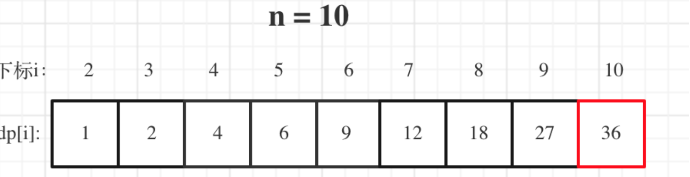

[参考](https://programmercarl.com/0343.%E6%95%B4%E6%95%B0%E6%8B%86%E5%88%86.html#%E6%80%9D%E8%B7%AF)  

给定一个正整数 n ，将其拆分为 k 个 正整数 的和（ k >= 2 ），并使这些整数的乘积最大化。  
返回 你可以获得的最大乘积 。

```
示例 1：  
输入: n = 2
输出: 1
解释: 2 = 1 + 1, 1 × 1 = 1。

示例 2：
输入: n = 10
输出: 36
解释: 10 = 3 + 3 + 4, 3 × 3 × 4 = 36。
```

思路：
1. 确定dp数组（dp table）以及下标的含义  
dp[i]：分拆数字i，可以得到的最大乘积为dp[i]。  
dp[i]的定义讲贯彻整个解题过程，下面哪一步想不懂了，就想想dp[i]究竟表示的是啥！  
2. 确定递推公式
可以想 dp[i]最大乘积是怎么得到的呢？  
其实可以从1遍历j，然后有两种渠道得到dp[i].  
一个是j * (i - j) 直接相乘。   
一个是j * dp[i - j]，相当于是拆分(i - j)，对这个拆分不理解的话，可以回想dp数组的定义。  
那有同学问了，j怎么就不拆分呢？  
j是从1开始遍历，拆分j的情况，在遍历j的过程中其实都计算过了。那么从1遍历j，比较(i - j) * j和dp[i - j] * j 取最大的。递推公式：dp[i] = max(dp[i], max((i - j) * j, dp[i - j] * j));   
也可以这么理解，j * (i - j) 是单纯的把整数拆分为两个数相乘，而j * dp[i - j]是拆分成两个以及两个以上的个数相乘。   
如果定义dp[i - j] * dp[j] 也是默认将一个数强制拆成4份以及4份以上了。   
所以递推公式：dp[i] = max({dp[i], (i - j) * j, dp[i - j] * j});  
那么在取最大值的时候，为什么还要比较dp[i]呢？  
因为在递推公式推导的过程中，每次计算dp[i]，取最大的而已。   
3. dp数组的初始化  
dp[2] = 1，从dp[i]的定义来说，拆分数字2，得到的最大乘积是1  
4. 确定遍历顺序  
确定遍历顺序，先来看看递归公式：dp[i] = max(dp[i], max((i - j) * j, dp[i - j] * j));  
dp[i] 是依靠 dp[i - j]的状态，所以遍历i一定是从前向后遍历，先有dp[i - j]再有dp[i]。  
枚举j的时候，是从1开始的。i是从3开始，这样dp[i - j]就是dp[2]正好可以通过我们初始化的数值求出来。  
所以遍历顺序为：
```
for (int i = 3; i <= n ; i++) {
    for (int j = 1; j < i - 1; j++) {
        dp[i] = max(dp[i], max((i - j) * j, dp[i - j] * j));
    }
}
```
5. 举例推导dp数组


```
/**
 * @param {number} n
 * @return {number}
 */
 
var integerBreak = function(n) {
  let dp=new Array(n+1).fill(1)
  
  for(let i=2;i<=n;i++){
    for(let j=0;j<i-1;j++){
      dp[i] = Math.max(dp[i], Math.max((i - j) * j, dp[i - j] * j));
    }
  }

  return dp[n]
};
```