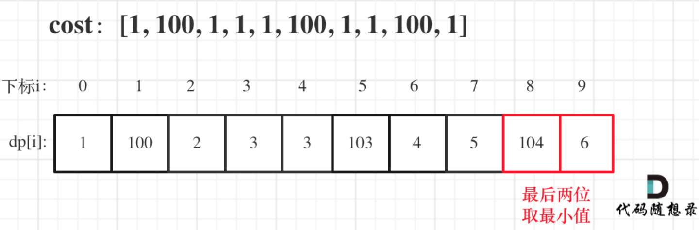

[参考](https://programmercarl.com/0746.%E4%BD%BF%E7%94%A8%E6%9C%80%E5%B0%8F%E8%8A%B1%E8%B4%B9%E7%88%AC%E6%A5%BC%E6%A2%AF.html#%E6%80%9D%E8%B7%AF)  
给你一个整数数组 cost ，其中 cost[i] 是从楼梯第 i 个台阶向上爬需要支付的费用。一旦你支付此费用，即可选择向上爬一个或者两个台阶。你可以选择从下标为 0 或下标为 1 的台阶开始爬楼梯。请你计算并返回达到楼梯顶部的最低花费。

```
示例 1：
输入：cost = [10,15,20]
输出：15
解释：你将从下标为 1 的台阶开始。
- 支付 15 ，向上爬两个台阶，到达楼梯顶部。
总花费为 15 。

示例 2：
输入：cost = [1,100,1,1,1,100,1,1,100,1]
输出：6
解释：你将从下标为 0 的台阶开始。
- 支付 1 ，向上爬两个台阶，到达下标为 2 的台阶。
- 支付 1 ，向上爬两个台阶，到达下标为 4 的台阶。
- 支付 1 ，向上爬两个台阶，到达下标为 6 的台阶。
- 支付 1 ，向上爬一个台阶，到达下标为 7 的台阶。
- 支付 1 ，向上爬两个台阶，到达下标为 9 的台阶。
- 支付 1 ，向上爬一个台阶，到达楼梯顶部。
总花费为 6 。
 
````

思路： 
1. 确定dp数组以及下标的含义
使用动态规划，就要有一个数组来记录状态，本题只需要一个一维数组dp[i]就可以了。  
dp[i]的定义：到达第i个台阶所花费的最少体力为dp[i]。（注意这里认为是第一步一定是要花费）  
对于dp数组的定义，大家一定要清晰！

2. 确定递推公式
可以有两个途径得到dp[i]，一个是dp[i-1] 一个是dp[i-2]。  
那么究竟是选dp[i-1]还是dp[i-2]呢？  
一定是选最小的，所以dp[i] = min(dp[i - 1], dp[i - 2]) + cost[i];  
注意这里为什么是加cost[i]，而不是cost[i-1],cost[i-2]之类的，因为题目中说了：每当你爬上一个阶梯你都要花费对应的体力值

3. dp数组如何初始化
根据dp数组的定义，dp数组初始化其实是比较难的，因为不可能初始化为第i台阶所花费的最少体力。  
那么看一下递归公式，dp[i]由dp[i-1]，dp[i-2]推出，既然初始化所有的dp[i]是不可能的，那么只初始化dp[0]和dp[1]就够了，其他的最终都是dp[0]dp[1]推出  

4. 确定遍历顺序  
最后一步，递归公式有了，初始化有了，如何遍历呢？  
本题的遍历顺序其实比较简单，简单到很多同学都忽略了思考这一步直接就把代码写出来了。  
因为是模拟台阶，而且dp[i]又dp[i-1]dp[i-2]推出，所以是从前到后遍历cost数组就可以了。  
但是稍稍有点难度的动态规划，其遍历顺序并不容易确定下来。  
例如：01背包，都知道两个for循环，一个for遍历物品嵌套一个for遍历背包容量，那么为什么不是一个for遍历背包容量嵌套一个for遍历物品呢？ 以及在使用一维dp数组的时候遍历背包容量为什么要倒序呢？
这些都是遍历顺序息息相关。当然背包问题后续「代码随想录」都会重点讲解的！

5. 举例推导dp数组
拿示例2：cost = [1, 100, 1, 1, 1, 100, 1, 1, 100, 1] ，来模拟一下dp数组的状态变化，如下：


```
/**
 * @param {number[]} cost
 * @return {number}
 */
var minCostClimbingStairs = function(cost) {
  let dp = new Array(cost.length).fill(0);
  dp[0] = cost[0];
  dp[1] = cost[1];

  for(let i=2;i<cost.length;i++){
    dp[i] = Math.min(dp[i-1],dp[i-2])+cost[i]
  }

  return Math.min(dp[cost.length-1],dp[cost.length-2])
};

```