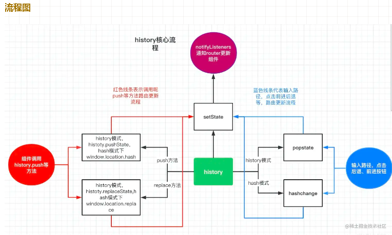

### ReactRouter 组件的理解，常用的 react router 组件

react-router 等前端路由的原理大致相同，可以实现无刷新的条件下切换显示不同的页面。  
路由的本质就是页面的 URL 发生改变时，页面的显示结果可以根据 URL 的变化而变化，但是页面不会刷新。  
因此，可以通过前端路由可以实现单页(SPA)应用

react-router 主要分成了几个不同的包：

- react-router: 实现了路由的核心功能
- react-router-dom： 基于 react-router，加入了在浏览器运行环境下的一些功能
- react-router-native：基于 react-router，加入了 react-native 运行环境下的一些功能
- react-router-config: 用于配置静态路由的工具库

### ReactRouter 常用组件

- BrowserRouter、HashRouter：使用两者作为最顶层组件包裹其他组件，分别匹配 history 模式和 hash 模式
- Route：Route 用于路径的匹配，然后进行组件的渲染，对应的属性如下：
  - path 属性：用于设置匹配到的路径
  - component 属性：设置匹配到路径后，渲染的组件
  - render 属性：设置匹配到路径后，渲染的内容
  - exact 属性：开启精准匹配，只有精准匹配到完全一致的路径，才会渲染对应的组件
- Link、NavLink：通常路径的跳转是使用 Link 组件，最终会被渲染成 a 元素，其中属性 to 代替 a 标题的 href 属性
  NavLink 是在 Link 基础之上增加了一些样式属性，例如组件被选中时，发生样式变化，则可以设置 NavLink 的一下属性：
  - activeStyle：活跃时（匹配时）的样式
  - activeClassName：活跃时添加的 class
- switch：switch 组件的作用适用于当匹配到第一个组件的时候，后面的组件就不应该继续匹配
- redirect：路由的重定向

### ReactRouter 常用 Hooks

- useHistory：组件内部直接访问 history，无须通过 props 获取
- useParams：获取路由参数
- useLocation：返回当前 URL 的 location 对象

### ReactRouter 传参

- 动态路由的方式（params） 优点：刷新页面，参数不丢失 缺点：1.只能传字符串，传值过多 url 会变得很长 2.参数必须在路由上配置
- search 传递参数 优点：刷新页面，参数不丢失 缺点：只能传字符串，传值过多 url 会变得很长，获取参数需要自定义 hooks
- state 传参 优点：可以传对象 缺点：1.<HashRouter>刷新页面，参数丢失, 2.<HashRouter>通过 state 传递参数，刷新页面后参数丢失，官方建议使用<BrowserRouter>，<BrowserRouter>页面刷新参数也不会丢失。
- query 优点：传参优雅，传递参数可传对象； 缺点：刷新地址栏，参数丢失

#### 动态路由的方式（params）

```
// 路由配置
{ path: '/detail/:id/:name', component: Detail }
```

```
// 路由跳转：
import { useHistory,useParams } from 'react-router-dom';
const history = useHistory();
// 跳转路由   地址栏：/detail/2/zora
history.push('/detail/2/zora')
<!--或者-->
this.props.history.push( '/detail/2/zora' )
```

```
// 获取路由参数
const params = useParams()
console.log(params) // {id: "2",name:"zora"}
<!-- 或者 -->
this.props.match.params
```

#### search 传递参数

路由不需要特别配置

路由跳转

```
import { useHistory } from 'react-router-dom';
const history = useHistory();
// 路由跳转  地址栏：/detail?id=2
history.push('/detail?id=2')
// 或者
history.push({pathname:'/detail',search:'?id=2'})
```

获取参数：所获取的是查询字符串，所以，还需要进一步的解析，自己自行解析，也可以使用第三方模块：qs，或者 nodejs 里的 query-string

```
const params = useLocation()
<!--或者-->
this.props.location.search
```

#### state 传参

路由不需要单独配置

路由跳转：

```
import { useHistory,useLocation } from 'react-router-dom';
const history = useHistory();
const item = {id:1,name:"zora"}
// 路由跳转
history.push(`/user/role/detail`, { id: item });

<!--或者-->
this.props.history.push({pathname:"/sort ",state : { name : 'sunny' }});
```

获取参数：

```
// 参数获取
const {state} = useLocation()
console.log(state)  // {id:1,name:"zora"}

<!--或者-->
this.props.location.state
```

#### query

路由不需要特别配置
路由跳转：

```
this.props.history.push({pathname:"/query",query: { name : 'sunny' }});
```

获取参数：

```
this.props.location.query.name
```

### React Router 有几种模式，实现原理是什么

react Router 有四个库：

- react router：核心库，封装了 Router，Route，Switch 等核心组件,实现了从路由的改变到组件的更新的核心功能,
- react router dom：dom 环境下的 router。在 react-router 的核心基础上，添加了用于跳转的 Link 组件，和 histoy 模式下的 BrowserRouter 和 hash 模式下的 HashRouter 组件等。所谓 BrowserRouter 和 HashRouter，也只不过用了 history 库中 createBrowserHistory 和 createHashHistory 方法
- react router native：RN 环境下的 router
- react router config

在单页应用中，一个 web 项目只有一个 html 页面，一旦页面加载完成之后，就不用因为用户的操作而进行页面的重新加载或者跳转，其特性如下：

- 改变 url 且不让浏览器像服务器发送请求
- 在不刷新页面的前提下动态改变浏览器地址栏中的 URL 地址

react router dom 其中主要分成了两种模式：

- hash 模式：在 url 后面加上#，如http://127.0.0.1:5500/home/#/page1
- history 模式：允许操作浏览器的曾经在标签页或者框架里访问的会话历史记录

React Router 对应的 hash 模式和 history 模式对应的组件为：

- HashRouter
- BrowserRouter
  这两个组件的使用都十分的简单，作为最顶层组件包裹其他组件

#### 原理

单页面应用路由实现原理是，切换 url，监听 url 变化，从而渲染不同的页面组件。

主要的方式有 history 模式和 hash 模式。

##### history 模式

① 改变路由  
**history.pushState**

```
history.pushState(state,title,path)

```

1. state：一个与指定网址相关的状态对象， popstate 事件触发时，该对象会传入回调函数。如果不需要可填 null。
2. title：新页面的标题，但是所有浏览器目前都忽略这个值，可填 null。
3. path：新的网址，必须与当前页面处在同一个域。浏览器的地址栏将显示这个地址
   **history.replaceState**

```
history.replaceState(state,title,path)
```

参数和 pushState 一样，这个方法会修改当前的 history 对象记录， history.length 的长度不会改变。

② 监听路由

```
window.addEventListener('popstate',function(e){
    /* 监听改变 */
})
```

同一个文档的 history 对象出现变化时，就会触发 popstate 事件  history.pushState 可以使浏览器地址改变，但是无需刷新页面。注意 ⚠️ 的是：用 history.pushState() 或者 history.replaceState() 不会触发 popstate 事件。 popstate 事件只会在浏览器某些行为下触发, 比如点击后退、前进按钮或者调用 history.back()、history.forward()、history.go()方法。

##### hash 模式

① 改变路由

```
window.location.hash
```

通过 window.location.hash 属性获取和设置 hash 值。
在 hash 模式下 ，history.push  底层是调用了 window.location.href 来改变路由。history.replace 底层是调用  window.location.replace 改变路由。
② 监听路由  
onhashchange

```
window.addEventListener('hashchange',function(e){
    /* 监听改变 */
})
```



### 当地址栏改变 url，组件的更新渲染都经历了什么

当 url 改变，首先触发 histoy，调用事件监听 popstate 事件， 触发回调函数 handlePopState，触发 history 下面的 setstate 方法，产生新的 location 对象，然后通知 Router 组件更新 location 并通过 context 上下文传递，switch 通过传递的更新流，匹配出符合的 Route 组件渲染，最后有 Route 组件取出 context 内容，传递给渲染页面，渲染更新。

### 当我们调用 history.push 方法，切换路由，组件的更新渲染又都经历了什么呢？

我们还是拿 history 模式作为参考，当我们调用 history.push 方法，首先调用 history 的 push 方法，通过 history.pushState 来改变当前 url，接下来触发 history 下面的 setState 方法，接下来的步骤就和上面一模一样了

### BrowserRouter 与 HashRouter 对⽐

- HashRouter 最简单，每次路由变化不需要服务端接入，根据浏览器的 hash 来区分 path 就可以；BrowserRouter 需要服务端解析 URL 返回页面，因此使用 BrowserRouter 需要在后端配置地址映射。
- BrowserRouter 触发路由变化的本质是使⽤ HTML5 history API（ pushState、replaceState 和 popstate 事件）
- HashRouter 不⽀持 location.key 和 location.state，动态路由需要通过?传递参数。
- Hash history 只需要服务端配置一个地址就可以上线，但线上的 web 应⽤很少使用这种方式。

### MemoryRouter

把 URL 的历史记录保存在内存中的 <Router>（不读取、不写入地址栏）。在测试和非浏览器环境中很有用，如 React Native
