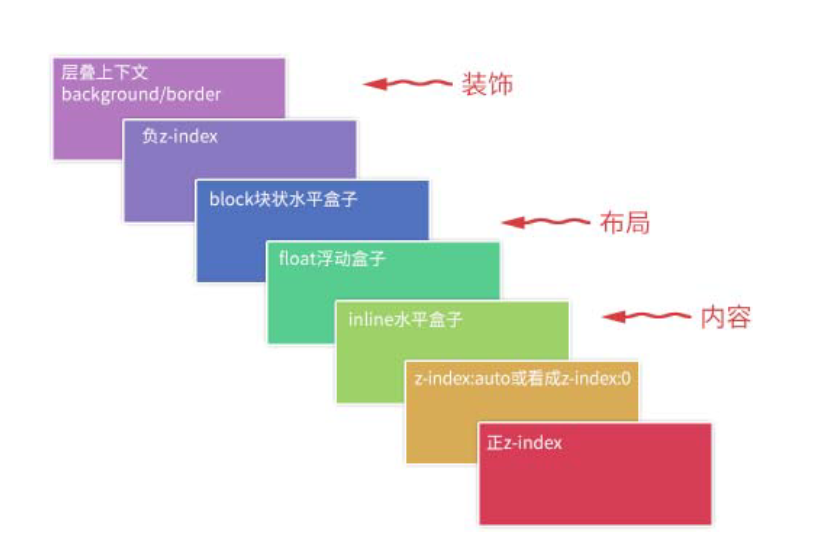
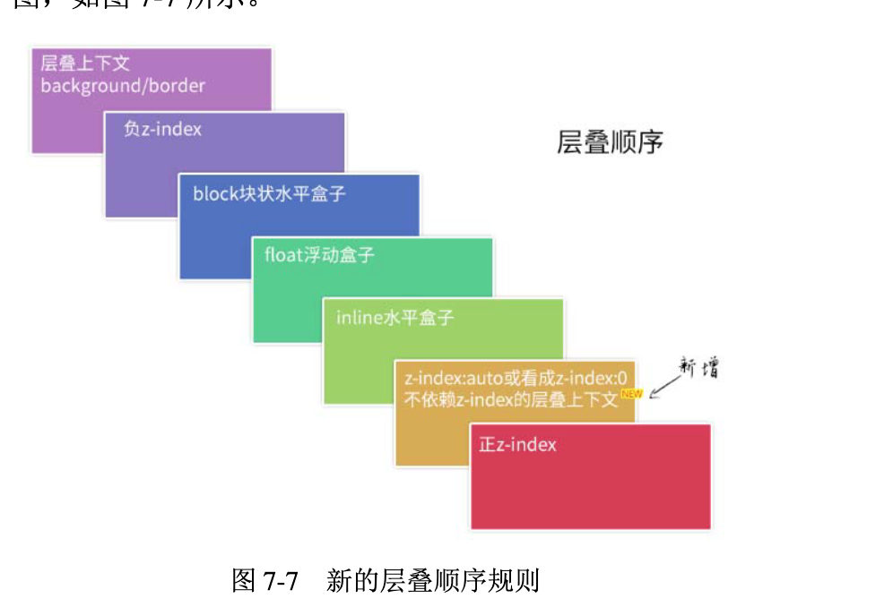
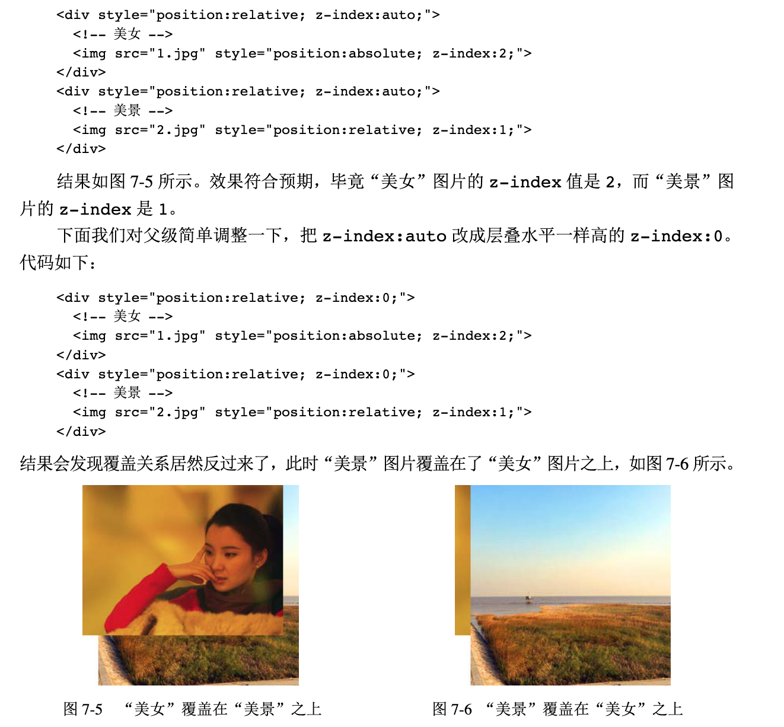

在CSS 世界中，z-index 属性只有和定位元素（position 不为static 的元素）在一起的时候才有作用，可以是正数也可以是负数。理论上说，数值越大层级越高。
但随着CSS3 新世界的到来，z-index 已经并非只对定位元素有效，flex 盒子的子元素也可以设置z-index 属性。
网页中绝大部分元素是非定位元素，并且影响层叠顺序的属性远不止 z-index一个，因此大家千万不要以为z-index 属性就可以代表CSS 世界的层叠规则，实际上z-index只是CSS 层叠规则中的一叶小舟，CSS 层叠规则的体量要比大家想象的要大得多。

css2

css3新规则

下面这两条是层叠领域的黄金准则。当元素发生层叠的时候，其覆盖关系遵循下面两条准则： 
- 谁大谁上：当具有明显的层叠水平标识的时候，如生效的 z-index 属性值，在同一个层叠上下文领域，层叠水平值大的那一个覆盖小的那一个。
- 后来居上：当元素的层叠水平一致、层叠顺序相同的时候，在 DOM 流中处于后面的元素会覆盖前面的元素。在 CSS 和 HTML 领域，只要元素发生了重叠，都离不开上面这两条黄金准则。

为什么小小的改变会产生相反的结果呢？差别就在于，z-index: auto 所在的
元素是一个普通定位元素，于是，里面的两个元素的层叠比较就不受父级的影响，两者直接套用“层叠黄金准则”。这里，两个元素有着明显不一的z-index 值，因此遵循“谁大谁上”的准则，于是，z-index 为2 的那个“美女”就显示在z-index 为1 的“美景”上面了。  
而 z-index 一旦变成数值，哪怕是 0，就会创建一个层叠上下文。此时，层叠规则就发生了变化。层叠上下文的特性里面最后一条是自成体系。两个元素的层叠顺序比较变成了优先比较其父级层叠上下文元素的层叠顺序。这里，由于外面的两个
元素都是z-index:0，两者层叠顺序一样大，此时遵循“层叠黄金准则”的另外一个准则“后来居上”，根据在DOM 文档流中的位置决定谁在上面，于是，位于后面的“美景”就自然而然显示在“美女”上面了。对，没错，元素上的z-index 没起作用！层叠上下文元素干扰了，可能就豁然开朗了。但我还是提一下，IE6 和IE7 浏览器有个bug，就是z-index:auto 的定位元素也会创建层叠上下文。这就是过去IE6 和IE7 的z-index 会折腾死人的原因。
再提一下position:fixed。在过去，position:fixed 和relative/ absolute在层叠上下文这一块是一样的，都是需要 z-index 为数值才行。但是，不知道什么时候起，Chrome 等WebKit 内核浏览器下，position:fixed 元素天然层叠上下文元素，无须z-index为数值。根据我的测试，目前IE 和Firefox 仍是老套路。

2．定位元素与传统层叠上下文 
对于position 值为relative/absolute 以及Firefox/IE 浏览器（不包括Chrome 浏览器）下含有position:fixed 声明的定位元素，当其z-index 值不是auto 的时候，会创建层叠上下文。  

为什么定位元素会层叠在普通元素的上面了吧？其根本原因就是：元素
一旦成为定位元素，其z-index 就会自动生效，此时其z-index 就是默认的auto，也就是0级别，根据上面的层叠顺序表，就会覆盖inline或block或float元素。而不支持z-index的层叠上下文元素天然是 z-index:auto 级别，也就意味着，层叠上下文元素和定位元素是一个层叠顺序的，于是当它们发生层叠的时候，遵循的是“后来居上”  

3．CSS3 与新时代的层叠上下文   
CSS3 新世界的出现除了带来了新属性，还对过去的很多规则发出了挑战，其中对层叠上下文规则的影响显得特别突出。
- （1）元素为 flex 布局元素（父元素 display:flex|inline-flex），同时 z-index值不是auto。
- （2）元素的opacity 值不是1。
- （3）元素的transform 值不是none。
- （4）元素mix-blend-mode 值不是normal。
- （5）元素的filter 值不是none。
- （6）元素的isolation 值是isolate。
- （7）元素的will-change 属性值为上面2～6 的任意一个（如will-change:opacity、will-chang:transform 等）。 
- （8）元素的-webkit-overflow-scrolling 设为touch。
