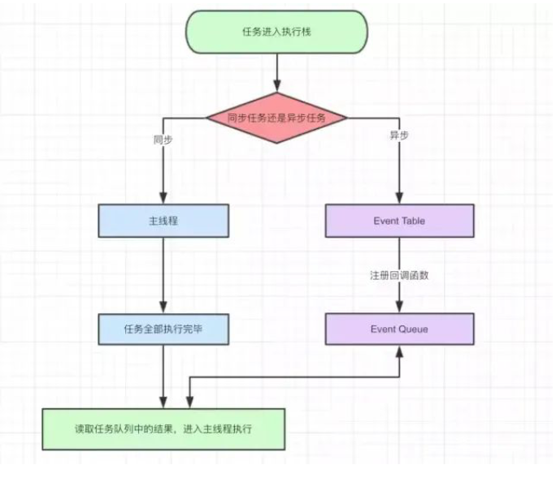

1、线程与进程
2、浏览器是多进程的
3、浏览器内核（渲染进程）
4、JS是单线程语言
5、JS单线程又是如何实现异步

一、线程与进程
关于线程与进程的关系可以用下面的图进行说明：

1) 进程好比图中的工厂，有单独的专属自己的工厂资源。
2) 线程好比图中的工人，多个工人在一个工厂中协作工作，工厂与工人是 1:n的关系。
3) 多个工厂之间独立存在。

官方的说法  
1) 进程是cpu资源分配的最小单位（是能拥有资源和独立运行的最小单位）  
2) 线程是cpu调度的最小单位（线程是建立在进程的基础上的一次程序运行单位，一个进程中可以有多个线程）  

二、浏览器是多进程的  
1) 浏览器是多进程的  
2) 浏览器之所以能够运行，是因为系统给它的进程分配了资源（cpu、内存）  
3) 简单点理解，每打开一个Tab页，就相当于创建了一个独立的浏览器进程   
 
三、浏览器内核（渲染进程）  
对于前端操作来说，最终要的是渲染进程。  
可以这样理解，页面的渲染，JS的执行，事件的循环，都在这个进程内进行。  
那么接下来看看它都包含了哪些线程（列举一些主要常驻线程）  

GUI渲染线程  
1) 负责渲染浏览器界面，解析HTML，CSS，构建DOM树和RenderObject树，布局和绘制等。  
2) 当界面需要重绘（Repaint）或由于某种操作引发回流(reflow)时，该线程就会执行。  
3) 注意，GUI渲染线程与JS引擎线程是互斥的，当JS引擎执行时GUI线程会被挂起（相当于被冻结了），GUI更新会被保存在一个队列中等到JS引擎空闲时立即被执行。  

JS引擎线程   
也称为JS内核，负责处理Javascript脚本程序。（例如V8引擎）  
1) JS引擎线程负责解析Javascript脚本，运行代码。  
2) JS引擎一直等待着任务队列中任务的到来，然后加以处理，一个Tab页（renderer进程）中无论什么时候都只有一个JS线程在运行JS程序。  
3) 同样注意，GUI渲染线程与JS引擎线程是互斥的，所以如果JS执行的时间过长，这样就会造成页面的渲染不连贯，导致页面渲染加载阻塞。  

事件触发线程  
1) 归属于浏览器而不是JS引擎，用来控制事件循环（可以理解，JS引擎自己都忙不过来，需要浏览器另开线程协助）。  
2) 当JS引擎执行代码块如setTimeOut时（也可来自浏览器内核的其他线程,如鼠标点击、AJAX异步请求等），会将对应任务添加到事件线程中。  
3) 当对应的事件符合触发条件被触发时，该线程会把事件添加到待处理队列的队尾，等待JS引擎的处理。  
4) 注意，由于JS的单线程关系，所以这些待处理队列中的事件都得排队等待JS引擎处理（当JS引擎空闲时才会去执行）。  

定时触发器线程  
1) 传说中的setInterval与setTimeout所在线程。  
2) 浏览器定时计数器并不是由JavaScript引擎计数的,（因为JavaScript引擎是单线程的, 如果处于阻塞线程状态就会影响记计时的准确）。  
3) 因此通过单独线程来计时并触发定时（计时完毕后，添加到事件队列中，等待JS引擎空闲后执行）。  
注意，W3C在HTML标准中规定，规定要求setTimeout中低于4ms的时间间隔算为4ms。  

异步http请求线程  
1) 在XMLHttpRequest在连接后是通过浏览器新开一个线程请求  
2) 将检测到状态变更时，如果设置有回调函数，异步线程就产生状态变更事件，将这个回调再放入事件队列中。再由JavaScript引擎执行。  
看到这里，如果觉得累了，可以先休息下，这些概念需要被消化，毕竟后续将提到的事件循环机制就是基于事件触发线程的。  

四、为什么JS是单线程  
JS最初被设计用在浏览器中，那么想象一下，如果浏览器中的JS是多线程的。  
场景描述：  
那么现在有2个进程，process1 process2，由于是多进程的JS，所以他们对同一个dom，同时进行操作。process1 删除了该dom，而process2 编辑了该dom，同时下达2个矛盾的命令，浏览器究竟该如何执行呢？  
这样想，JS为什么被设计成单线程应该就容易理解了吧。  

五、为什么JS需要异步  
场景描述：  
如果JS中不存在异步，只能自上而下执行，如果上一行解析时间很长，那么下面的代码就会被阻塞。对于用户而言，阻塞就意味着"卡死"，这样就导致了很差的用户体验  
所以，JS中存在异步执行。  

六、JS单线程又是如何实现异步  
既然JS是单线程的，只能在一条线程上执行，又是如何实现的异步呢？  
是通过的事件循环(event loop)，理解了event loop机制，就理解了JS的执行机制。  

导图要表达的内容用文字来表述的话：  
1) 同步和异步任务分别进入不同的执行"场所"，同步的进入主线程，异步的进入Event Table(事件列表)并注册函数。  
2) 当指定的事情完成时，Event Table会将这个函数移入Event Queue(事件队列)。  
3) 主线程内的任务执行完毕为空，会去Event Queue读取对应的函数，进入主线程执行。  
4) 上述过程会不断重复，也就是常说的Event Loop(事件循环)。  

事实上，按照异步和同步的划分方式，并不准确。  
而准确的划分方式是：  
1、微任务 （microtask）：优先级高，并且可以插队，不是先定义先执行。包括：promise 中的 then，observer，MutationObserver，setImmediate。  
2、宏任务 （macrotask）：优先级低，先定义的先执行。包括：ajax，setTimeout，setInterval，事件绑定，postMessage，MessageChannel（用于消息通讯）。  

* 举个栗子 🌰
```
Promise.resolve().then(()=>{
  console.log('Promise1')
  setTimeout(()=>{
    console.log('setTimeout2')
  },0)
})
setTimeout(()=>{
  console.log('setTimeout1')
  Promise.resolve().then(()=>{
    console.log('Promise2')
  })
},0)
```
最后输出结果是 Promise1，setTimeout1，Promise2，setTimeout2

根据事件循环机制，重新梳理一下流程：  
1) 执行一个宏任务（首次执行的主代码块或者任务队列中的回调函数）  
2) 执行过程中如果遇到微任务，就将它添加到微任务的任务队列中  
3) 宏任务执行完毕后，立即执行当前微任务队列中的所有任务（依次执行）  
4) JS引擎线程挂起，GUI线程执行渲染  
5) GUI线程渲染完毕后挂起，JS引擎线程执行任务队列中的下一个宏任务  
说明：
1) 当某个宏任务执行完后,会查看是否有微任务队列。  
2) 如果有，先执行微任务队列中的所有任务，  
3) 如果没有，会读取宏任务队列中排在最前的任务，执行宏任务的过程中，遇到微任务，依次加入微任务队列。  
4) 栈空后，再次读取微任务队列里的任务，依次类推。  