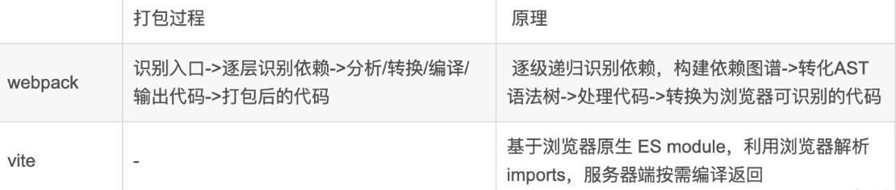

webpack会先打包，然后启动开发服务器，请求服务器时直接给予打包结果。  
vite直接启动开发服务器，请求哪个模块再对该模块进行实时编译。

打包原理：

### vite优点：
- webpack服务器启动速度比vite慢
- 由于vite启动的时候不需要打包，也就无需分析模块依赖、编译，所以启动速度非常快。当浏览器请求需要的模块时，再对模块进行编译，这种按需动态编译的模式，极大缩短了编译时间，当项目越大，文件越多时，vite的开发时优势越明显
- vite热更新比webpack快
- vite在HRM方面，当某个模块内容改变时，让浏览器去重新请求该模块即可，而不是像webpack重新将该模块的所有依赖重新编译；
- vite使用esbuild(Go 编写) 预构建依赖，而webpack基于nodejs, 比node快 10-100 倍

### vite缺点：
- 生态不及webpack，加载器、插件不够丰富
- 打包到生产环境时，vite使用传统的rollup进行打包，生产环境esbuild构建对于css和代码分割不够友好。所以，vite的优势是体现在开发阶段
- 没被大规模重度使用，会隐藏一些问题
- 项目的开发浏览器要支持esmodule，而且不能识别commonjs语法

---- 

### 什么是 Vite
- Vite是新一代的前端构建工具

### Vite 核心原理

- Vite其核心原理是利用浏览器现在已经支持ES6的import，碰见import就会发送一个HTTP请求去加载文件。
- Vite启动一个 koa 服务器拦截这些请求，并在后端进行相应的处理将项目中使用的文件通过简单的分解与整合，然后再以ESM格式返回给浏览器。
- Vite整个过程中没有对文件进行打包编译，做到了真正的按需加载，所以其运行速度比原始的webpack开发编译速度快出许多！

### 它具有以下特点：
- 快速的冷启动：采用No Bundle和esbuild预构建，速度远快于Webpack
- 高效的热更新：基于ESM实现，同时利用HTTP头来加速整个页面的重新加载，增加缓存策略：源码模块使用协商缓存，依赖模块使用强缓；因此一旦被缓存它们将不需要再次请求。
- 基于 Rollup 打包：生产环境下由于esbuild对css和代码分割并使用Rollup进行打包；

### 基于 ESM 的 Dev server

在Vite出来之前，传统的打包工具如Webpack是先解析依赖、打包构建再启动开发服务器，Dev Server 必须等待所有模块构建完成后才能启动，当我们修改了 bundle模块中的一个子模块， 整个 bundle 文件都会重新打包然后输出。项目应用越大，启动时间越长。

而Vite利用浏览器对ESM的支持，当 import 模块时，浏览器就会下载被导入的模块。先启动开发服务器，当代码执行到模块加载时再请求对应模块的文件，本质上实现了动态加载。

### 基于 ESM 的 HMR 热更新
HMR 全称 Hot Module Replacement，中文语境通常翻译为模块热更新，它能够在保持页面状态的情况下动态替换资源模块，提供丝滑顺畅的 Web 页面开发体验。

所有的 HMR 原理：
目前所有的打包工具实现热更新的思路都大同小异：主要是通过WebSocket创建浏览器和服务器的通信监听文件的改变，当文件被修改时，服务端发送消息通知客户端修改相应的代码，客户端对应不同的文件进行不同的操作的更新。
Vite 的表现：

Vite 监听文件系统的变更，只用对发生变更的模块重新加载，这样HMR 更新速度就不会因为应用体积的增加而变慢

而 Webpack 还要经历一次打包构建。

所以 HMR 场景下，Vite 表现也要好于 Webpack。

### 基于 Esbuild 的依赖预编译优化
Vite预编译之后，将文件缓存在node_modules/.vite/文件夹下
#### 为什么需要预编译 & 预构建

- 支持 非ESM 格式的依赖包：Vite是基于浏览器原生支持ESM的能力实现的，因此必须将commonJs的文件提前处理，转化成 ESM 模块并缓存入 node_modules/.vite
- 减少模块和请求数量：Vite 将有许多内部模块的 ESM 依赖关系转换为单个模块，以提高后续页面加载性能。
- 如果不使用esbuild进行预构建，浏览器每检测到一个import语句就会向服务器发送一个请求，如果一个三方包被分割成很多的文件，这样就会发送很多请求，会触发浏览器并发请求限制；

#### 为什么用 Esbuild
- Esbuild 打包速度太快了，比类似的工具快10~100倍，

#### Esbuild 为什么这么快
- Esbuild 使用 Go 语言编写，可以直接被转化为机器语言，在启动时直接执行；
- 而其余大多数的打包工具基于 JS 实现，是解释型语言，需要边运行边解释；
- JS 本质上是单线程语言，GO语言天生具有多线程的优势，充分利用 CPU 资源；