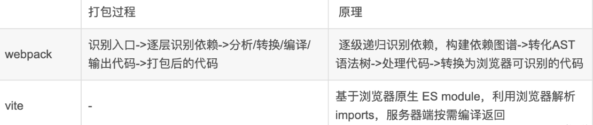

webpack会先打包，然后启动开发服务器，请求服务器时直接给予打包结果。  
vite直接启动开发服务器，请求哪个模块再对该模块进行实时编译。

打包原理：

### vite优点：
- webpack服务器启动速度比vite慢
- 由于vite启动的时候不需要打包，也就无需分析模块依赖、编译，所以启动速度非常快。当浏览器请求需要的模块时，再对模块进行编译，这种按需动态编译的模式，极大缩短了编译时间，当项目越大，文件越多时，vite的开发时优势越明显
- vite热更新比webpack快
- vite在HRM方面，当某个模块内容改变时，让浏览器去重新请求该模块即可，而不是像webpack重新将该模块的所有依赖重新编译；
- vite使用esbuild(Go 编写) 预构建依赖，而webpack基于nodejs, 比node快 10-100 倍

### vite缺点：
- 生态不及webpack，加载器、插件不够丰富
- 打包到生产环境时，vite使用传统的rollup进行打包，生产环境esbuild构建对于css和代码分割不够友好。所以，vite的优势是体现在开发阶段
- 没被大规模重度使用，会隐藏一些问题
- 项目的开发浏览器要支持esmodule，而且不能识别commonjs语法
