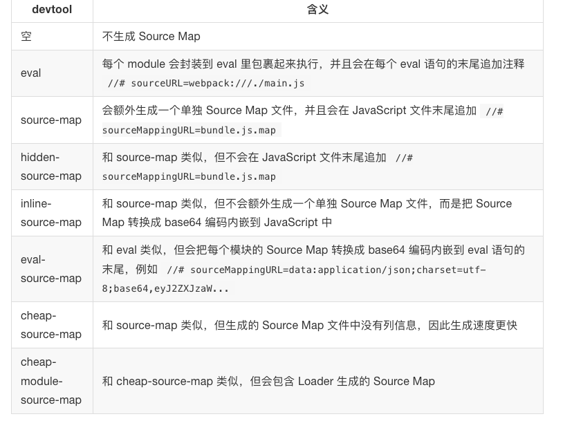

文章来源：[深入浅出webpack](https://github.com/gwuhaolin/dive-into-webpack)

# 第三章：实战

## 3-1 使用 ES6 语言

    通常我们需要把采用 ES6 编写的代码转换成目前已经支持良好的 ES5 代码，这包含2件事：

    1.把新的 ES6 语法用 ES5 实现，例如 ES6 的 class 语法用 ES5 的 prototype 实现。
    
    2.给新的 API 注入 polyfill ，例如项目使用 fetch API 时，只有注入对应的 polyfill 后，才能在低版本浏览器中正常运行。

### Babel  

  Babel 可以方便的完成以上2件事。 Babel 是一个 JavaScript 编译器，能将 ES6 代码转为 ES5 代码，让你使用最新的语言特性而不用担心兼容性问题，并且可以通过插件机制根据需求灵活的扩展。 在 Babel 执行编译的过程中，会从项目根目录下的 .babelrc 文件读取配置。.babelrc 是一个 JSON 格式的文件，内容大致如下：
```
{
  "plugins": [
    [
      "transform-runtime",
      {
        "polyfill": false
      }
    ]
   ],
  "presets": [
    [
      "es2015",
      {
        "modules": false
      }
    ],
    "stage-2",
    "react"
  ]
}
```

### Plugins

  plugins 属性告诉 Babel 要使用哪些插件，插件可以控制如何转换代码。

  以上配置文件里的 transform-runtime 对应的插件全名叫做 babel-plugin-transform-runtime，即在前面加上了 babel-plugin-，要让 Babel 正常运行我们必须先安装它：
  npm i -D babel-plugin-transform-runtime

  babel-plugin-transform-runtime 是 Babel 官方提供的一个插件，作用是减少冗余代码。 Babel 在把 ES6 代码转换成 ES5 代码时通常需要一些 ES5 写的辅助函数来完成新语法的实现，例如在转换 class extent 语法时会在转换后的 ES5 代码里注入 _extent 辅助函数用于实现继承：
```
  function _extent(target) {
  for (var i = 1; i < arguments.length; i++) {
    var source = arguments[i];
    for (var key in source) {
      if (Object.prototype.hasOwnProperty.call(source, key)) {
        target[key] = source[key];
      }
    }
  }
  return target;
}

```
这会导致每个使用了 class extent 语法的文件都被注入重复的_extent 辅助函数代码，babel-plugin-transform-runtime 的作用在于不把辅助函数内容注入到文件里，而是注入一条导入语句：
```
var _extent = require('babel-runtime/helpers/_extent');
```
这样能减小 Babel 编译出来的代码的文件大小。


### Presets  
presets 属性告诉 Babel 要转换的源码使用了哪些新的语法特性，一个 Presets 对一组新语法特性提供支持，多个 Presets 可以叠加。 Presets 其实是一组 Plugins 的集合，每一个 Plugin 完成一个新语法的转换工作。  
分类：
1. 已经被写入 ECMAScript 标准里的特性，
2. 被社区提出来的但还未被写入 ECMAScript 标准里特性
3. 为了支持一些特定应用场景下的语法，和 ECMAScript 标准没有关系，例如 babel-preset-react 是为了支持 React 开发中的 JSX 语法。

### webpack 接入 Babel
```
module.exports = {
  module: {
    rules: [
      {
        test: /\.js$/,
        use: ['babel-loader'],
      },
    ]
  },
  // 输出 source-map 方便直接调试 ES6 源码
  devtool: 'source-map'
};
```
---
## 3-2 使用 TypeScript 语言

TypeScript 官方提供了能把 TypeScript 转换成 JavaScript 的编译器。 你需要在当前项目根目录下新建一个用于配置编译选项的 tsconfig.json 文件，编译器默认会读取和使用这个文件，配置文件内容大致如下：

```
{
  "compilerOptions": {
    "module": "commonjs", // 编译出的代码采用的模块规范
    "target": "es5", // 编译出的代码采用 ES 的哪个版本
    "sourceMap": true // 输出 Source Map 方便调试
  },
  "exclude": [ // 不编译这些目录里的文件
    "node_modules"
  ]
}
```

通过 npm install -g typescript 安装编译器到全局后，你可以通过 tsc hello.ts 命令编译出 hello.js 和 hello.js.map 文件。

### 减少代码冗余
TypeScript 编译器会有和在 3-1 使用ES6语言中 Babel 一样的问题：在把 ES6 语法转换成 ES5 语法时需要注入辅助函数， 为了不让同样的辅助函数重复的出现在多个文件中，可以开启 TypeScript 编译器的 importHelpers 选项，修改 tsconfig.json 文件如下：
```
{
  "compilerOptions": {
    "importHelpers": true
  }
}
```
该选项的原理和 Babel 中介绍的 babel-plugin-transform-runtime 非常类似，会把辅助函数换成如下导入语句：
```
var _tslib = require('tslib');
_tslib._extend(target);
```
这会导致编译出的代码依赖 tslib 这个迷你库，但避免了代码冗余.

### 集成 Webpack
要让 Webpack 支持 TypeScript，需要解决以下2个问题：
1. 通过 Loader 把 TypeScript 转换成 JavaScript。
2. Webpack 在寻找模块对应的文件时需要尝试 ts 后缀。  

对于问题1，社区已经出现了几个可用的 Loader，推荐速度更快的 awesome-typescript-loader。    
对于问题2，根据2-4 Resolve 中的 extensions 我们需要修改默认的 resolve.extensions 配置项。

```
const path = require('path');

module.exports = {
  // 执行入口文件
  entry: './main',
  output: {
    filename: 'bundle.js',
    path: path.resolve(__dirname, './dist'),
  },
  resolve: {
    // 先尝试 ts 后缀的 TypeScript 源码文件
    extensions: ['.ts', '.js']
  },
  module: {
    rules: [
      {
        test: /\.ts$/,
        loader: 'awesome-typescript-loader'
      }
    ]
  },
  devtool: 'source-map',// 输出 Source Map 方便在浏览器里调试 TypeScript 代码
};
```

## 3-3 使用 Flow 检查器
- todo
## 3-4 使用 SCSS 语言
- todo
## 3-5 使用 PostCSS
- todo
## 3-6 使用 React 框架
JSX 语法是无法在任何现有的 JavaScript 引擎中运行的，所以在构建过程中需要把源码转换成可以运行的代码，例如：
```
// 原 JSX 语法代码
return <h1>Hello,Webpack</h1>

// 被转换成正常的 JavaScript 代码
return React.createElement('h1', null, 'Hello,Webpack')
```

### React 与 Babel

````
# 安装 babel 完成语法转换所需依赖
npm i -D babel-preset-react
````
安装新的依赖后，再修改 .babelrc 配置文件加入 React Presets
```
"presets": [
    "react"
],
```
### React 与 TypeScript
注： 由于 React 不是采用 TypeScript 编写的，需要安装 react 和 react-dom 对应的 TypeScript 接口描述模块 @types/react 和 @types/react-dom 后才能通过编译。

修改 TypeScript 编译器配置文件 tsconfig.json 增加对 JSX 语法的支持，如下：

```
{
  "compilerOptions": {
    "jsx": "react" // 开启 jsx ，支持 React
  }
}
```
让 Webpack 对项目里的 ts 与 tsx 原文件都采用 awesome-typescript-loader 去转换
```
const path = require('path');

module.exports = {
  // TS 执行入口文件
  entry: './main',
  output: {
    filename: 'bundle.js',
    path: path.resolve(__dirname, './dist'),
  },
  resolve: {
    // 先尝试 ts，tsx 后缀的 TypeScript 源码文件
    extensions: ['.ts', '.tsx', '.js',]
  },
  module: {
    rules: [
      {
        // 同时匹配 ts，tsx 后缀的 TypeScript 源码文件
        test: /\.tsx?$/,
        loader: 'awesome-typescript-loader'
      }
    ]
  },
  devtool: 'source-map',// 输出 Source Map 方便在浏览器里调试 TypeScript 代码
};
```

## 3-7 使用 Vue 框架


```
安装新引入的依赖：
# Vue 框架运行需要的库
npm i -S vue
# 构建所需的依赖
npm i -D vue-loader css-loader vue-template-compile
```
```

module: {
  rules: [
    {
      test: /\.vue$/,
      use: ['vue-loader'],
    },
  ]
}
```

在这些依赖中，它们的作用分别是：
1. vue-loader：解析和转换 .vue 文件，提取出其中的逻辑代码 script、样式代码 style、以及 HTML 模版 template，再分别把它们交给对应的 Loader 去处理。  
2. css-loader：加载由 vue-loader 提取出的 CSS 代码。  
3. vue-template-compiler：把 vue-loader 提取出的 HTML 模版编译成对应的可执行的 JavaScript 代码，这和 React 中的 JSX 语法被编译成 JavaScript 代码类似。预先编译好 HTML 模版相对于在浏览器中再去编译 HTML 模版的好处在于性能更好。  

# 3-8 使用 Angular2 框架

# 3-9 为单页应用生成 HTML
手动构建问题：  

    部分代码被内嵌进了 HTML 的 HEAD 标签中，部分文件的文件名称被打上根据文件内容算出的 Hash 值，并且加载这些文件的 URL 地址也被正常的注入到了 HTML 中。 如果你还采用手写 index.html 文件去完成以上要求，这就会使工作变得复杂、易错，项目难以维护。
     
解决方案： 

     Webpack 插件 web-webpack-plugin。 
```
const path = require('path');
const UglifyJsPlugin = require('webpack/lib/optimize/UglifyJsPlugin');
const ExtractTextPlugin = require('extract-text-webpack-plugin');
const DefinePlugin = require('webpack/lib/DefinePlugin');
const { WebPlugin } = require('web-webpack-plugin');

module.exports = {
  entry: {
    app: './main.js'// app 的 JavaScript 执行入口文件
  },
  output: {
    filename: '[name]_[chunkhash:8].js',// 给输出的文件名称加上 Hash 值
    path: path.resolve(__dirname, './dist'),
  },
  module: {
    rules: [
      {
        test: /\.js$/,
        use: ['babel-loader'],
        // 排除 node_modules 目录下的文件，
        // 该目录下的文件都是采用的 ES5 语法，没必要再通过 Babel 去转换
        exclude: path.resolve(__dirname, 'node_modules'),
      },
      {
        test: /\.css$/,// 增加对 CSS 文件的支持
        // 提取出 Chunk 中的 CSS 代码到单独的文件中
        use: ExtractTextPlugin.extract({
          use: ['css-loader?minimize'] // 压缩 CSS 代码
        }),
      },
    ]
  },
  plugins: [
    // 使用本文的主角 WebPlugin，一个 WebPlugin 对应一个 HTML 文件
    new WebPlugin({
      template: './template.html', // HTML 模版文件所在的文件路径
      filename: 'index.html' // 输出的 HTML 的文件名称
    }),
    new ExtractTextPlugin({
      filename: `[name]_[contenthash:8].css`,// 给输出的 CSS 文件名称加上 Hash 值
    }),
    new DefinePlugin({
      // 定义 NODE_ENV 环境变量为 production，以去除源码中只有开发时才需要的部分
      'process.env': {
        NODE_ENV: JSON.stringify('production')
      }
    }),
    // 压缩输出的 JavaScript 代码
    new UglifyJsPlugin({
      // 最紧凑的输出
      beautify: false,
      // 删除所有的注释
      comments: false,
      compress: {
        // 在UglifyJs删除没有用到的代码时不输出警告
        warnings: false,
        // 删除所有的 `console` 语句，可以兼容ie浏览器
        drop_console: true,
        // 内嵌定义了但是只用到一次的变量
        collapse_vars: true,
        // 提取出出现多次但是没有定义成变量去引用的静态值
        reduce_vars: true,
      }
    }),
  ],
};
```

# 3-10 管理多个单页应用

```
const { AutoWebPlugin } = require('web-webpack-plugin');

// 使用本文的主角 AutoWebPlugin，自动寻找 pages 目录下的所有目录，把每一个目录看成一个单页应用
const autoWebPlugin = new AutoWebPlugin('pages', {
  template: './template.html', // HTML 模版文件所在的文件路径
  postEntrys: ['./common.css'],// 所有页面都依赖这份通用的 CSS 样式文件
  // 提取出所有页面公共的代码
  commonsChunk: {
    name: 'common',// 提取出公共代码 Chunk 的名称
  },
});

module.exports = {
  // AutoWebPlugin 会为寻找到的所有单页应用，生成对应的入口配置，
  // autoWebPlugin.entry 方法可以获取到所有由 autoWebPlugin 生成的入口配置
  entry: autoWebPlugin.entry({
    // 这里可以加入你额外需要的 Chunk 入口
  }),
  plugins: [
    autoWebPlugin,
  ],
};
```

## 3-11 构建同构应用
同构应用是指写一份代码但可同时在浏览器和服务器中运行的应用。

### 认识同构应用
    现在大多数单页应用的视图都是通过 JavaScript 代码在浏览器端渲染出来的，但在浏览器端渲染的坏处有：

    搜索引擎无法收录你的网页，因为展示出的数据都是在浏览器端异步渲染出来的，大部分爬虫无法获取到这些数据。
    对于复杂的单页应用，渲染过程计算量大，对低端移动设备来说可能会有性能问题，用户能明显感知到首屏的渲染延迟。
    为了解决以上问题，有人提出能否将原本只运行在浏览器中的 JavaScript 渲染代码也在服务器端运行，在服务器端渲染出带内容的 HTML 后再返回。 这样就能让搜索引擎爬虫直接抓取到带数据的 HTML，同时也能降低首屏渲染时间。 由于 Node.js 的流行和成熟，以及虚拟 DOM 提出与实现，使这个假设成为可能。

    实际上现在主流的前端框架都支持同构，包括 React、Vue2、Angular2，其中最先支持也是最成熟的同构方案是 React。 由于 React 使用者更多，它们之间又很相似，本节只介绍如何用 Webpack 构建 React 同构应用。

    同构应用运行原理的核心在于虚拟 DOM，虚拟 DOM 的意思是不直接操作 DOM 而是通过 JavaScript Object 去描述原本的 DOM 结构。 在需要更新 DOM 时不直接操作 DOM 树，而是通过更新 JavaScript Object 后再映射成 DOM 操作。

    虚拟 DOM 的优点在于：

    因为操作 DOM 树是高耗时的操作，尽量减少 DOM 树操作能优化网页性能。而 DOM Diff 算法能找出2个不同 Object 的最小差异，得出最小 DOM 操作；
    虚拟 DOM 的在渲染的时候不仅仅可以通过操作 DOM 树来表示出结果，也能有其它的表示方式，例如把虚拟 DOM 渲染成字符串(服务器端渲染)，或者渲染成手机 App 原生的 UI 组件( React Native)。
    以 React 为例，核心模块 react 负责管理 React 组件的生命周期，而具体的渲染工作可以交给 react-dom 模块来负责。

    react-dom 在渲染虚拟 DOM 树时有2中方式可选：

    通过 render() 函数去操作浏览器 DOM 树来展示出结果。
    通过 renderToString() 计算出表示虚拟 DOM 的 HTML 形式的字符串。
    构建同构应用的最终目的是从一份项目源码中构建出2份 JavaScript 代码，一份用于在浏览器端运行，一份用于在 Node.js 环境中运行渲染出 HTML。 其中用于在 Node.js 环境中运行的 JavaScript 代码需要注意以下几点：

    不能包含浏览器环境提供的 API，例如使用 document 进行 DOM 操作， 　因为 Node.js 不支持这些 API；
    不能包含 CSS 代码，因为服务端渲染的目的是渲染出 HTML 内容，渲染出 CSS 代码会增加额外的计算量，影响服务端渲染性能；
    不能像用于浏览器环境的输出代码那样把 node_modules 里的第三方模块和 Node.js 原生模块(例如 fs 模块)打包进去，而是需要通过 CommonJS 规范去引入这些模块。
    需要通过 CommonJS 规范导出一个渲染函数，以用于在 HTTP 服务器中去执行这个渲染函数，渲染出 HTML 内容返回。

解决方案

    由于要从一份源码构建出2份不同的代码，需要有2份 Webpack 配置文件分别与之对应。 构建用于浏览器环境的配置和前面讲的没有差别，本节侧重于讲如何构建用于服务端渲染的代码。

    用于构建浏览器环境代码的 webpack.config.js 配置文件保留不变，新建一个专门用于构建服务端渲染代码的配置文件 webpack_server.config.js，内容如下：
```
const path = require('path');
const nodeExternals = require('webpack-node-externals');

module.exports = {
  // JS 执行入口文件
  entry: './main_server.js',
  // 为了不把 Node.js 内置的模块打包进输出文件中，例如 fs net 模块等
  target: 'node',
  // 为了不把 node_modules 目录下的第三方模块打包进输出文件中
  externals: [nodeExternals()],
  output: {
    // 为了以 CommonJS2 规范导出渲染函数，以给采用 Node.js 编写的 HTTP 服务调用
    libraryTarget: 'commonjs2',
    // 把最终可在 Node.js 中运行的代码输出到一个 bundle_server.js 文件
    filename: 'bundle_server.js',
    // 输出文件都放到 dist 目录下
    path: path.resolve(__dirname, './dist'),
  },
  module: {
    rules: [
      {
        test: /\.js$/,
        use: ['babel-loader'],
        exclude: path.resolve(__dirname, 'node_modules'),
      },
      {
        // CSS 代码不能被打包进用于服务端的代码中去，忽略掉 CSS 文件
        test: /\.css$/,
        use: ['ignore-loader'],
      },
    ]
  },
  devtool: 'source-map' // 输出 source-map 方便直接调试 ES6 源码
};
```

以上代码有几个关键的地方，分别是：

- target: 'node' 由于输出代码的运行环境是 Node.js，源码中依赖的 Node.js 原生模块没必要打包进去；  
- externals: [nodeExternals()] webpack-node-externals 的目的是为了防止 node_modules 目录下的第三方模块被打包进去，因为 Node.js 默认会去 node_modules 目录下寻找和使用第三方模块；  
- {test: /\.css$/, use: ['ignore-loader']} 忽略掉依赖的 CSS 文件，CSS 会影响服务端渲染性能，又是做服务端渲不重要的部分；  
- libraryTarget: 'commonjs2' 以 CommonJS2 规范导出渲染函数，以供给采用 Node.js 编写的 HTTP 服务器代码调用。  

## 3-12 构建 Electron 应用
- todo

## 3-13 构建 Npm 模块
- todo

## 3-14 构建离线应用
- todo

# 3-15 搭配 Npm Script
 
举一个常见的例子，要求如下：

在开发阶段为了提高开发体验，使用 DevServer 做开发，并且需要输出 Source Map 以方便调试，同时还需要开启自动刷新功能。
为了减小发布到线上的代码尺寸，在构建出发布到线上的代码时，需要压缩输出的代码。
在构建完发布到线上的代码后，需要把构建出的代码提交给发布系统。

```
"scripts": {
  "dev": "webpack-dev-server --open",
  "dist": "NODE_ENV=production webpack --config webpack_dist.config.js",
  "pub": "npm run dist && rsync dist"
},
```

含义分别是：

- dev 代表用于开发时执行的任务，通过 DevServer 去启动构建。所以在开发项目时只需执行 npm run dev。
- dist 代表构建出用于发布到线上去的代码，输出到 dist 目录中。其中的 NODE_ENV=production 是为了在运行任务时注入环境变量。
- pub 代表先构建出用于发布到线上去的代码，再同步 dist 目录中的文件到发布系统(如何同步文件需根据你所使用的发布系统而定)。所以在开发完后需要发布时只需执行 npm run pub。

## 3-16 检查代码

### 检查 JavaScript
目前最常用的 JavaScript 检查工具是 ESlint ，它不仅内置了大量常用的检查规则，还可以通过插件机制做到灵活扩展。

```
npm i -g eslint

eslint --init
```
新建一个 ESlint 配置文件 .eslintrc，该文件格式为 JSON。

如果你想覆盖默认的检查规则，或者想加入新的检查规则，你需要修改该文件，例如使用以下配置：
```
{
    // 从 eslint:recommended 中继承所有检查规则
    "extends": "eslint:recommended",
    // 再自定义一些规则     
    "rules": {
        // 需要在每行结尾加 ;        
        "semi": ["error", "always"],
        // 需要使用 "" 包裹字符串         
        "quotes": ["error", "double"]
    }
}
```
写好配置文件后，再执行

eslint yourfile.js

### 检查 TypeScript

TSLint 和 ESlint 的使用方法很相似，首先通过
```
npm i -g tslint

tslint --init

tslint yourfile.ts
```

### 检查 CSS
stylelint 是目前最成熟的 CSS 检查工具，内置了大量检查规则的同时也提供插件机制让用户自定义扩展。 stylelint 基于 PostCSS，能检查任何 PostCSS 能解析的代码，诸如 SCSS、Less 等。
```
npm i -g stylelint
```
新建 .stylelintrc 配置文件

```
{
  // 继承 stylelint-config-standard 中的所有检查规则
  "extends": "stylelint-config-standard",
  // 再自定义检查规则  
  "rules": {
    "at-rule-empty-line-before": null
  }
}
```
配置好后，再执行
```
stylelint "yourfile.css"
```

### 结合 Webpack 检查代码
以上介绍的代码检查工具可以和 Webpack 结合起来，在开发过程中通过 Webpack 输出实时的检查结果。
- 结合 ESLint
```
module.exports = {
  module: {
    rules: [
      {
        test: /\.js$/,
        // node_modules 目录的下的代码不用检查
        exclude: /node_modules/,
        loader: 'eslint-loader',
        // 把 eslint-loader 的执行顺序放到最前面，防止其它 Loader 把处理后的代码交给 eslint-loader 去检查
        enforce: 'pre',
      },
    ],
  },
}
```
- 结合 TSLint
```
module.exports = {
  module: {
    rules: [
      {
        test: /\.ts$/,
        // node_modules 目录的下的代码不用检查
        exclude: /node_modules/,
        loader: 'tslint-loader',
        // 把 tslint-loader 的执行顺序放到最前面，防止其它 Loader 把处理后的代码交给 tslint-loader 去检查
        enforce: 'pre',
      },
    ],
  },
}
```
- 结合 stylelint
```
const StyleLintPlugin = require('stylelint-webpack-plugin');

module.exports = {
  // ...
  plugins: [
    new StyleLintPlugin(),
  ],
}
```

### 一些建议
把代码检查功能整合到 Webpack 中会导致以下问题：

- 由于执行检查步骤计算量大，整合到 Webpack 中会导致构建变慢；
- 在整合代码检查到 Webpack 后，输出的错误信息是通过行号来定位错误的，没有编辑器集成显示错误直观；

为了避免以上问题，还可以这样做：

- 使用集成了代码检查功能的编辑器，让编辑器实时直观地显示错误；
- 把代码检查步骤放到代码提交时，也就是说在代码提交前去调用以上检查工具去检查代码，只有在检查都通过时才提交代码，这样就能保证提交到仓库的代码都是通过了检查的。
如果你的项目是使用 Git 管理，Git 提供了 Hook 功能能做到在提交代码前触发执行脚本。

husky 可以方便快速地为项目接入 Git Hook， 执行
```
npm i -D husky
```
安装 husky 时，husky 会通过 Npm Script Hook 自动配置好 Git Hook，你需要做的只是在 package.json 文件中定义几个脚本，方法如下：
```
{
  "scripts": {
    // 在执行 git commit 前会执行的脚本  
    "precommit": "npm run lint",
    // 在执行 git push 前会执行的脚本  
    "prepush": "lint",
    // 调用 eslint、stylelint 等工具检查代码
    "lint": "eslint && stylelint"
  }
}
```
precommit 和 prepush 你需要根据自己的情况选择一个，无需两个都设置。

## 3-17 通过 Node.js API 启动 Webpack
- todo

## 3-18 使用 Webpack Dev Middleware
- todo

## 3-19 加载图片

在网页中不可避免的会依赖图片资源，例如 PNG、JPG、GIF，下面来教你如何用 Webpack 加载图片资源。

### 使用 file-loader
```
#app {
  background-image: url(./imgs/a.png);
}

// 转换后
#app {
  background-image: url(5556e1251a78c5afda9ee7dd06ad109b.png);
}
```


```
module.exports = {
  module: {
    rules: [
      {
        test: /\.png$/,
        use: ['file-loader']
      }
    ]
  }
};

```

### 使用 url-loader
url-loader 可以把文件的内容经过 base64 编码后注入到 JavaScript 或者 CSS 中去。
```
#app {
  background-image: url(./imgs/a.png);
}

// 转换后
#app {
  background-image: url(data:image/png;base64,iVBORw01afer...); /* 结尾省略了剩下的 base64 编码后的数据 */
}
```

```
module.exports = {
  module: {
    rules: [
      {
        test: /\.png$/,
        use: [{
          loader: 'url-loader',
          options: {
            // 30KB 以下的文件采用 url-loader
            limit: 1024 * 30,
            // 否则采用 file-loader，默认值就是 file-loader 
            fallback: 'file-loader',
          }
        }]
      }
    ]
  },
};
````

除此之外，你还可以做以下优化：
- 通过 imagemin-webpack-plugin 压缩图片；
- 通过 webpack-spritesmith 插件制作雪碧图。

## 3-20 加载 SVG
SVG 作为矢量图的一种标准格式，已经得到了各大浏览器的支持，它也成为了 Web 中矢量图的代名词。 在网页中采用 SVG 代替位图有如下好处：

- SVG 相对于位图更清晰，在任意缩放的情况下后不会破坏图形的清晰度，SVG 能方便地解决高分辨率屏幕下图像显示不清楚的问题。
- 在图形线条比较简单的情况下，SVG 文件的大小要小于位图，在扁平化 UI 流行的今天，多数情况下 SVG 会更小。
- 图形相同的 SVG 比对应的高清图有更好的渲染性能。
- SVG 采用和 HTML 一致的 XML 语法描述，灵活性很高。

使用 file-loader 和 使用 url-loader 对 SVG 来说同样有效，只需要把 Loader test 配置中的文件后缀改成 .svg，代码如下：
```
module.exports = {
  module: {
    rules: [
      {
        test: /\.svg/,
        use: ['file-loader']
      }
    ]
  },
};
```

### 使用 raw-loader
```
module.exports = {
  module: {
    rules: [
      {
        test: /\.svg$/,
        use: ['raw-loader']
      }
    ]
  }
```

### 使用 svg-inline-loader
```
module.exports = {
  module: {
    rules: [
      {
        test: /\.svg$/,
        use: ['svg-inline-loader']
      }
    ]
  }
};
```

## 3-21 加载 Source Map

由于在开发过程中经常会使用新语言去开发项目，最后会把源码转换成能在浏览器中直接运行的 JavaScript 代码。 这样做虽能提升开发效率，在调试代码的过程中你会发现生成的代码可读性非常差，这给代码调试带来了不便。

Webpack 支持为转换生成的代码输出对应的 Source Map 文件，以方便在浏览器中能通过源码调试。 控制 Source Map 输出的 Webpack 配置项是 devtool，它有很多选项，下面来一一详细介绍。

