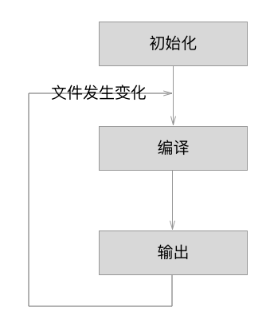
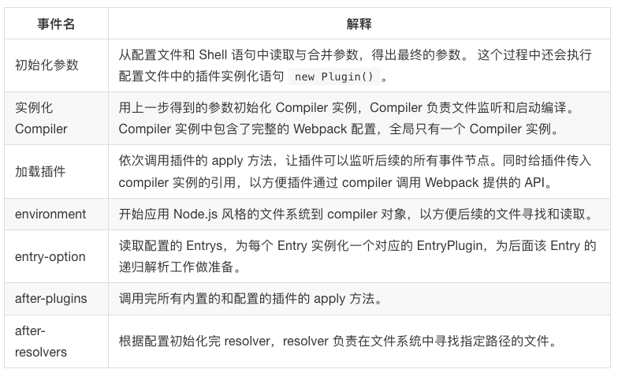
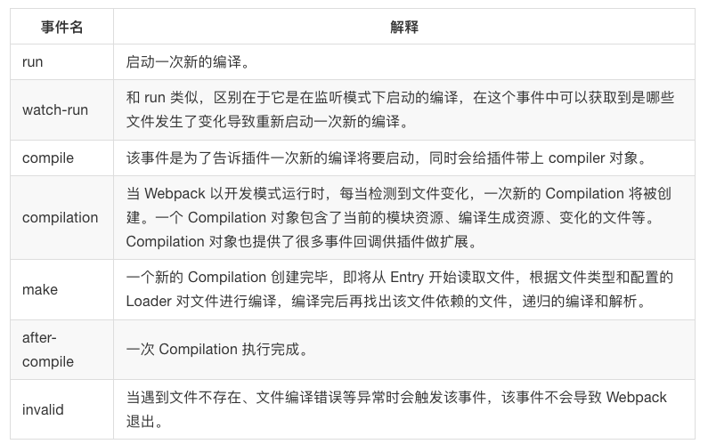
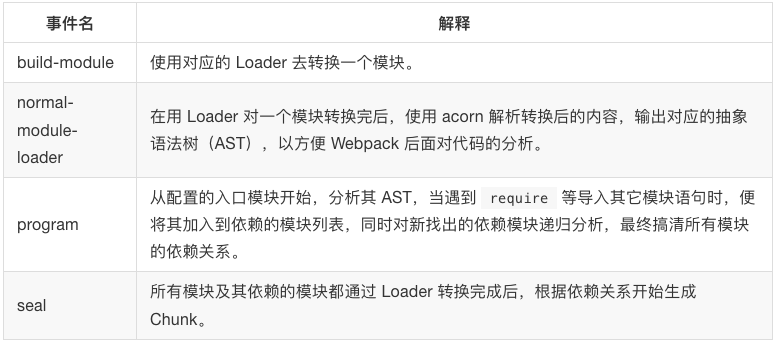
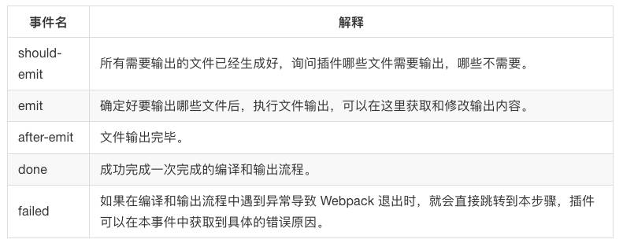

文章来源：[深入浅出webpack](https://github.com/gwuhaolin/dive-into-webpack)

# 第5章 原理

## 5-1 工作原理概括

### 基本概念
- Entry：入口，Webpack 执行构建的第一步将从 Entry 开始，可抽象成输入。
- Module：模块，在 Webpack 里一切皆模块，一个模块对应着一个文件。Webpack 会从配置的 Entry 开始递归找出所有依赖的模块。
- Chunk：代码块，一个 Chunk 由多个模块组合而成，用于代码合并与分割。
- Loader：模块转换器，用于把模块原内容按照需求转换成新内容。
- Plugin：扩展插件，在 Webpack 构建流程中的特定时机会广播出对应的事件，插件可以监听这些事件的发生，在特定时机做对应的事情。

### 流程概括
  Webpack 的运行流程是一个串行的过程，从启动到结束会依次执行以下流程：

    1.初始化参数：从配置文件和 Shell 语句中读取与合并参数，得出最终的参数；
    2.开始编译：用上一步得到的参数初始化 Compiler 对象，加载所有配置的插件，执行对象的 run 方法开始执行编译；
    3.确定入口：根据配置中的 entry 找出所有的入口文件；
    4.编译模块：从入口文件出发，调用所有配置的 Loader 对模块进行翻译，再找出该模块依赖的模块，再递归本步骤直到所有入口依赖的文件都经过了本步骤的处理；
    5.完成模块编译：在经过第4步使用 Loader 翻译完所有模块后，得到了每个模块被翻译后的最终内容以及它们之间的依赖关系；
    6.输出资源：根据入口和模块之间的依赖关系，组装成一个个包含多个模块的 Chunk，再把每个 Chunk 转换成一个单独的文件加入到输出列表，这步是可以修改输出内容的最后机会；
    7.输出完成：在确定好输出内容后，根据配置确定输出的路径和文件名，把文件内容写入到文件系统。

  在以上过程中，Webpack 会在特定的时间点广播出特定的事件，插件在监听到感兴趣的事件后会执行特定的逻辑，并且插件可以调用 Webpack 提供的 API 改变 Webpack 的运行结果。

### 流程细节
  Webpack 的构建流程可以分为以下三大阶段：

    1.初始化：启动构建，读取与合并配置参数，加载 Plugin，实例化 Compiler。
    2.编译：从 Entry 发出，针对每个 Module 串行调用对应的 Loader 去翻译文件内容，再找到该 Module 依赖的 Module，递归地进行编译处理。
    3.输出：对编译后的 Module 组合成 Chunk，把 Chunk 转换成文件，输出到文件系统。

  如果只执行一次构建，以上阶段将会按照顺序各执行一次。但在开启监听模式下，流程将变为如下：
  

### 初始化阶段
  

### 编译阶段
  
在编译阶段中，最重要的要数 compilation 事件了，因为在 compilation 阶段调用了 Loader 完成了每个模块的转换操作，在 compilation 阶段又包括很多小的事件，它们分别是：
  

### 输出阶段
  
  在输出阶段已经得到了各个模块经过转换后的结果和其依赖关系，并且把相关模块组合在一起形成一个个 Chunk。 在输出阶段会根据 Chunk 的类型，使用对应的模版生成最终要要输出的文件内容。

## 5-2 输出文件分析

```
(
    // webpackBootstrap 启动函数
    // modules 即为存放所有模块的数组，数组中的每一个元素都是一个函数
    function (modules) {
        // 安装过的模块都存放在这里面
        // 作用是把已经加载过的模块缓存在内存中，提升性能
        var installedModules = {};

        // 去数组中加载一个模块，moduleId 为要加载模块在数组中的 index
        // 作用和 Node.js 中 require 语句相似
        function __webpack_require__(moduleId) {
            // 如果需要加载的模块已经被加载过，就直接从内存缓存中返回
            if (installedModules[moduleId]) {
                return installedModules[moduleId].exports;
            }

            // 如果缓存中不存在需要加载的模块，就新建一个模块，并把它存在缓存中
            var module = installedModules[moduleId] = {
                // 模块在数组中的 index
                i: moduleId,
                // 该模块是否已经加载完毕
                l: false,
                // 该模块的导出值
                exports: {}
            };

            // 从 modules 中获取 index 为 moduleId 的模块对应的函数
            // 再调用这个函数，同时把函数需要的参数传入
            modules[moduleId].call(module.exports, module, module.exports, __webpack_require__);
            // 把这个模块标记为已加载
            module.l = true;
            // 返回这个模块的导出值
            return module.exports;
        }

        // Webpack 配置中的 publicPath，用于加载被分割出去的异步代码
        __webpack_require__.p = "";

        // 使用 __webpack_require__ 去加载 index 为 0 的模块，并且返回该模块导出的内容
        // index 为 0 的模块就是 main.js 对应的文件，也就是执行入口模块
        // __webpack_require__.s 的含义是启动模块对应的 index
        return __webpack_require__(__webpack_require__.s = 0);

    })(

    // 所有的模块都存放在了一个数组里，根据每个模块在数组的 index 来区分和定位模块
    [
        /* 0 */
        (function (module, exports, __webpack_require__) {
            // 通过 __webpack_require__ 规范导入 show 函数，show.js 对应的模块 index 为 1
            const show = __webpack_require__(1);
            // 执行 show 函数
            show('Webpack');
        }),
        /* 1 */
        (function (module, exports) {
            function show(content) {
                window.document.getElementById('app').innerText = 'Hello,' + content;
            }
            // 通过 CommonJS 规范导出 show 函数
            module.exports = show;
        })
    ]
);
```

以上看上去复杂的代码其实是一个立即执行函数，可以简写为如下：
```
(function(modules) {

  // 模拟 require 语句
  function __webpack_require__() {
  }

  // 执行存放所有模块数组中的第0个模块
  __webpack_require__(0);

})([/*存放所有模块的数组*/])
```
bundle.js 能直接运行在浏览器中的原因在于输出的文件中通过 __webpack_require__ 函数定义了一个可以在浏览器中执行的加载函数来模拟 Node.js 中的 require 语句。

原来一个个独立的模块文件被合并到了一个单独的 bundle.js 的原因在于浏览器不能像 Node.js 那样快速地去本地加载一个个模块文件，而必须通过网络请求去加载还未得到的文件。 如果模块数量很多，加载时间会很长，因此把所有模块都存放在了数组中，执行一次网络加载。

如果仔细分析 __webpack_require__ 函数的实现，你还有发现 Webpack 做了缓存优化： 执行加载过的模块不会再执行第二次，执行结果会缓存在内存中，当某个模块第二次被访问时会直接去内存中读取被缓存的返回值。

### 分割代码时的输出
- todo

## 5-3 编写 Loader
- todo

## 5-4 编写 Plugin
- todo
## 5-5 调试 Webpack
- todo
