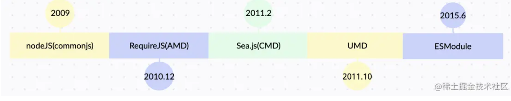
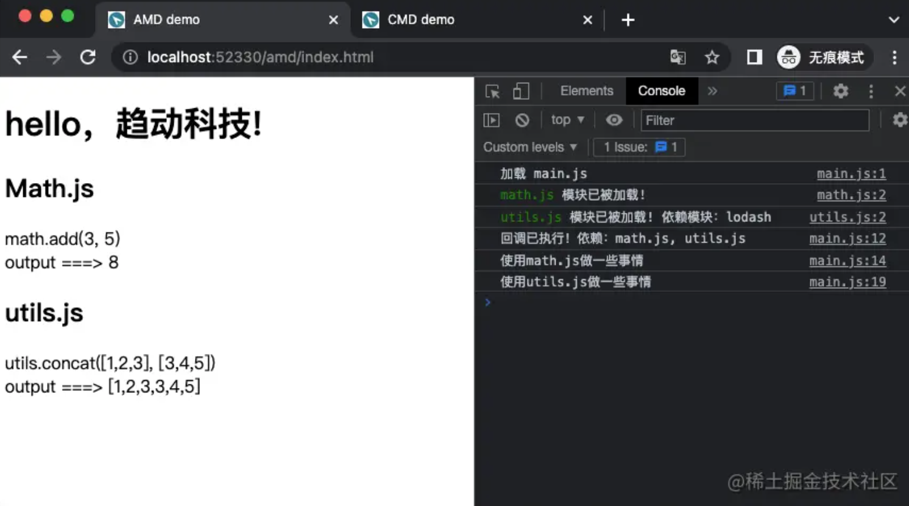
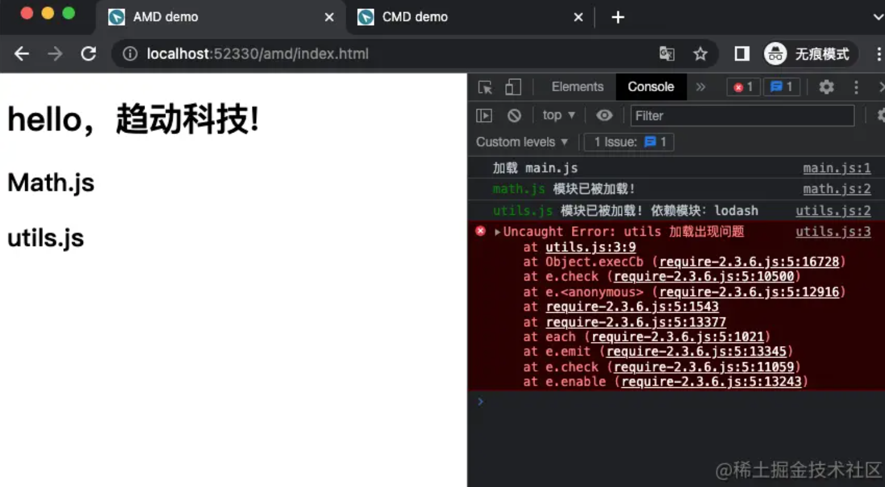
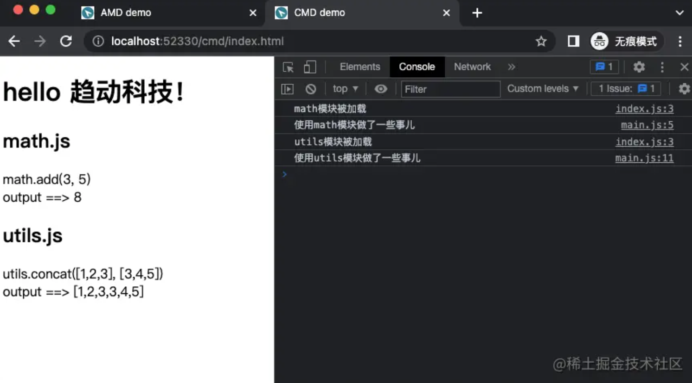
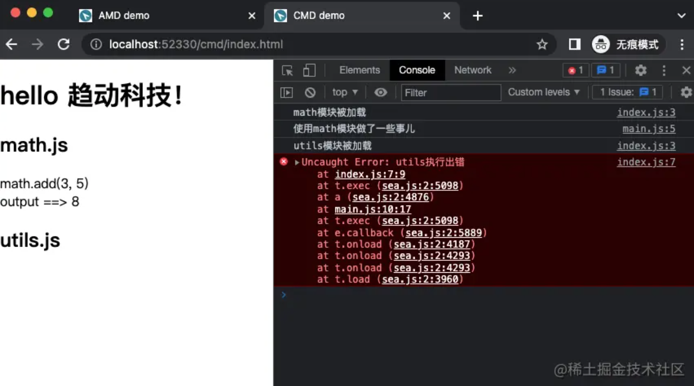

[文章来源](https://juejin.cn/post/7137922542961950757)
# 背景
在前端发展历程中的早期阶段，Javascript的使命只是单纯为了实现简单的页面交互逻辑，通过script标签引入js文件，全部混杂在一个全局作用域中。然而随着互联网的发展，前端应用复杂度直线上升，Javascript的使用不再是单纯的交互，而是需要去管理大量状态、复杂交互。随之便出现了各种类库，如Jquery，underscore，backbone等等。通过script标签引入第三方库会存在以下问题：
- 加载顺序的不可控
- 依赖关系的不明确
- 命名冲突、作用域污染等

于是社区借鉴其他语言的优点，开始推动前端模块化。下图是几个模块化重要的时间点，借着这个时间线，讲讲模块化发展的历程。


# CommonJS（2009）
关键词：同步、服务端、require、exports、module.exports

在09年nodejs面世后，一种同步的模块系统commonjs也出现了，在开始叫做serverjs，因为其是作为服务端，通过磁盘读写，能够同步读取文件内容，编译执行得到模块接口。

```
// math.js
exports.add = function(a, b) {
  return a + b;
};
```
```
// index.js
var add = require('./math.js').add;
add(3, 5); // 8
```
然而这种同步读取的方式在浏览器端并不适用，因为浏览器端不像服务端是加载本地的文件，而是通过script标签异步加载远程。  

因为在Node.js环境下反馈比较好，社区大佬们便开始把这套规范带到浏览器端。于是乎，出现了像AMD、CMD这种支持在浏览器端的模块加载方式，并且流行了一段时间。

# RequireJs - AMD（2010.12）

关键词：浏览器端、require、define、异步加载模块、回调函数
```
Using a modular script loader like RequireJS will improve the speed and quality of your code.
使用像 RequreJS 这样的模块化脚本加载器可以提高代码的速度和质量。
```
RequireJs是AMD规范的代表，AMD全称为Asynchronous Module Definition，异步模块规范。顾名思义，保留浏览器异步加载模块的特性，但是能提升开发体验。如官网原文：
看一个简单的AMD例子：
目录结构如下，其中lodash-min为官网下载lodash，math及utils为自定义模块

```
├── index.html
├── js
│   ├── lib
│   │   ├── lodash-min.js
│   │   ├── math.js
│   │   └── utils.js
│   └── main.js
└── require-2.3.6.js
```
可以看到requireJS在script标签上有一个独有的属性，data-main作为入口模块进行加载
```
<!-- index.html -->
<!DOCTYPE html>
<html lang="en">
<head>
  <title>AMD demo</title>
  <!-- data-main是requirejs规定的入口文件写法，省略.js -->
  <script src="./require-2.3.6.js" data-main="js/main"></script>
</head>
<body>
  <h1>hello，趋动科技!</h1>
  <h2>Math.js</h2>
  <div id="math"></div>
  <h2>utils.js</h2>
  <div id="utils"></div>
</body>
</html>
```
在入口模块中，需要先执行配置方法，告知requireJS去哪里加载其他依赖模块
```
// js/main.js
// 对requirejs设置一些配置
require.config({
  baseUrl: "js/lib", // 设置基础文件路径
  paths: {
    math: "math", // 定义js/lib/math.js的文件模块名为math
    lodash: "lodash-min", // 定义js/lib/lodash-min.js的文件模块名为lodash
    utils: "utils" // 定义js/lib/utils.js的文件模块名为utils
  },
});

// 依赖math和utils，会等待math模块加载完成后，才执行回调函数
require(["math", "utils"], (math, utils) => {
  console.log("回调已执行！依赖：math.js, utils.js");
  
  console.log("使用math.js做一些事情")
  document.getElementById("math").innerHTML = `
    math.add(3, 5)<br>
    output ===> ${math.add(3, 5)}
  `;
  console.log("使用utils.js做一些事情")
  document.getElementById("utils").innerHTML = `
    utils.concat([1,2,3], [3,4,5])<br>
    output ===> ${JSON.stringify(utils.concat([1,2,3], [3,4,5]))}
  `;
});
```
```
// js/lib/math.js
define(function () {
  console.log("%cmath.js", "color: green;", " 模块已被加载!");
  var add = function (x, y) {
    return x + y;
  };
  return {
    add,
  };
});
```
```
define(["lodash"], (_) => {
  console.log("%cutils.js", "color: green;", "模块已被加载!", "依赖模块：lodash");
  return {
    concat: _.concat,
  };
});
```

假如在加载模块时，其中模块模块出现了问题，则会导致整个回调函数无法执行。

对utils模块做一些修改
```
define(["lodash"], (_) => {
  console.log("%cutils.js", "color: green;", "模块已被加载!", "依赖模块：lodash");
  throw new Error('lodash 加载出现问题')
  return {
    concat: _.concat,
  };
});
```

总结一下requireJS有以下特点

- 引入require.js会在全局定义define、require。
- 通过define可以创建一个自定义模块。
- require函数第一个参数为字符串数组，负责定义要注入哪些依赖模块，第二个参数为回调函数，回调函数的参数顺序会对应依赖数组中的模块顺序。
- 只有当依赖全被加载完成后，才会执行回调函数。

requireJs实现了一套适用于浏览器端的模块加载机制，并且定义了一套模块写法。很好的解决了传统script标签的一些弊端，降低了开发者对于模块管理的心智负担，提升了开发体验。那为什么还会出现Sea.js呢？与requireJS有什么不一样？

# Sea.js - CMD（2011.2）

关键词：浏览器端、就近加载、require、exports、module

起因是玉伯在不断给RequireJS提建议，但是都没被采纳的情况下，才萌生了自己写模块加载器的想法。所以借鉴RequireJS的一些优点，Sea.js由此诞生，也伴随着CMD规范的确立。

CMD全称Common Module Definition，和AMD最明显的差别时，CMD模块规范遵从就近原则，认为只有在需要的时候才进行模块加载。

我们来看CMD规范的写法：

```
define(function(require, exports, module) {
  var module1 = require('module1')
  // 使用module1做一些事儿
  var module2 = require('module2')
  // 使用module2做一些事儿
})
```
而在AMD规范写法应该是：
```
define(['module1', 'module2'], function(module1, module2) {
  // 使用module1做一些事儿
  // 使用module2做一些事儿
})
```

```
├── index.html
├── js
│   └── main.js
└── sea-modules
    ├── jquery
    │   └── jquery
    │       └── 1.10.1
    │           └── jquery.js
    ├── math
    │   └── index.js
    ├── seajs
    │   └── seajs
    │       └── 2.2.0
    │           ├── package.json
    │           ├── sea-debug.js
    │           └── sea.js
    └── utils
        └── index.js
```
其中math和utils是自定义模块，main.js作为一个入口文件
```
<!-- cmd/index.html -->
<!DOCTYPE html>
<html>
  <head>
    <meta charset="utf-8" />
    <title>CMD demo</title>
  </head>
  <body>
    <h1>hello 趋动科技！</h1>
    <h2>math.js</h2>
    <div id="math"></div>
    <h2>utils.js</h2>
    <div id="utils"></div>
    <!-- 加载seajs -->
    <script src="./sea-modules/seajs/seajs/2.2.0/sea.js"></script>
    <!-- 做一些基础配置 -->
    <script>
      seajs.config({
        base: "./sea-modules/",
        alias: {
          jquery: "jquery/jquery/1.10.1/jquery.js",
          math: "math/index",
          utils: "utils/index",
        },
      });
      // 执行入口文件
      seajs.use("./js/main");
    </script>
  </body>
</html>
```

```
// cmd/js/main.js
define(function (require, exports, module) {

  const math = require("math");
  console.log("使用math模块做了一些事儿");
  document.getElementById('math').innerHTML = `
    math.add(3, 5)<br>
    output ==> ${math.add(3, 5)}
  `
  const utils = require('utils')
  console.log('使用utils模块做了一些事儿')
  document.getElementById('utils').innerHTML = `
    utils.concat([1,2,3], [3,4,5])<br>
    output ==> ${JSON.stringify(utils.concat([1,2,3], [3,4,5]))}
  `
});
```
```
// cmd/sea-modules/math/index.js
define(function(require, exports, module) {
  console.log('math模块被加载')
  const add = function (a, b) {
    return a + b;
  }
  module.exports = {
    add
  }
});
```
```
// cmd/sea-modules/utils/index.js
define(function(require, exports, module) {
  console.log('utils模块被加载')
  const concat = function(arr1, arr2) {
    return [...arr1, ...arr2]
  }
  module.exports = {
    concat
  }
});
```
看运行结果:

可以看得出来，加载模块，并使用模块处理逻辑，这个动作是串行的，而不是像requireJs全都加载完成后才做业务逻辑。

接下来对utils模块做一些修改，看加载出错时，会怎么样。
```
// cmd/sea-modules/utils/index.js
define(function(require, exports, module) {
  console.log('utils模块被执行')
  const concat = function(arr1, arr2) {
    return [...arr1, ...arr2]
  }
  throw new Error('utils执行出错')
  module.exports = {
    concat
  }
});
```

加载到错误模块之前，所有的代码都是会正常执行的。这个差异就是CMD最核心的差异了，以玉伯为代表的开发者认为这对他们来说是一种更为自然的流程。
两种模块加载方式各有优点，比如sea.js的即用即加载，跟接近于CommonJs，甚至可以说只需要把CommonJs模块做一层define(function(require, exports, module))的包装，便可以跑在浏览器端了。
# UMD（2011.10）
UMD即Universal Module Definition，通用的模块定义规范。
在模块化标准激烈的争论时期，每个人都有自己认为最好的模块规范，流行的类库就难以避免的要去兼容多种模块化标准，这会使得维护成本非常高。
所以UMD可以说是应运而生，按照UMD规范实现的模块，能够被所有的主流规范使用，如AMD、CommonJS等。提供一个简化版UMD规范的例子：

```
(function (root, factory) {
  if (typeof define === "function" && define.amd) {
    // AMD
    define(["jquery"], factory);
  } else if (typeof exports === "object") {
    // Node, CommonJS-like
    module.exports = factory(require("jquery"));
  } else {
    // 全局变量写法
    root.returnExports = factory(root.jQuery);
  }
})(this, function ($) {
  function myFunc() {}
  return myFunc;
});
```
所以可以认为UMD是一种兼容方式，让开源库的开发者们可以更加专注与类库本身的实现。也能类库使用者感到方便，比如不需要在node环境require('lodash-commonjs')，在浏览器环境require('lodash-amd')。
在模块化标准还没确立的日子里，这是一种过渡方案。在Webpack中就有一个配置项output.libratryTarget若把值设为umd，这会把所有的模块打包成一个umd格式的模块。

# ESModule（2015.6）
关键词：import、export default、export、编译时、静态分析  

在ES6规范中，正式确立了标准化的Module语法，这是在语言标准的层面上，实现了模块的功能，并且实现的相当简单，可以完全取代CommonJS和AMD规范，能够成为浏览器和服务端通用的模块解决方案。

ESModule设计思想是尽量的静态化，这样在编译时就能确定模块的依赖关系，并且这使得项目在构建时，能够只加载需要的代码，优化项目体积。此外这个特性能够支持类型检查等。
举个例子：
```
// 传统写法，commonjs-like
// math.js
const add = (a, b) => {
  return a + b;
};
const subtract = (a, b) => {
  return a - b;
};
module.exports = {
  add,
  subtract,
};

// index.js
const { add } = require("./math.js");
add(3, 5) // ===> 8
```
在传统的commonjs-like写法中，尽管是只使用到math中的add方法，但是在运行时仍是通过完整的加载math对象后，再从中取出add方法。
```
// ESModule 写法
// math.js
const add = (a, b) => {
  return a + b;
};
const subtract = (a, b) => {
  return a - b;
};
export { add, subtract }

// index.js
import { add } from './math.js'
add(3, 5) // ===> 8
```
而在ESModule的场景下，能够静态分析出只依赖了math.js中的add方法，只引用add，而不会引用subtract。这种方式效率要比CommonJS高。
由于标准化的确立，不管是主流浏览器还是Node都已经在底层实现了对ESModule规范的支持。并且社区也产生了大量基于ESModule的工具，比如新的构建工具Vite，已经开始动摇Webpack多年的统治。
