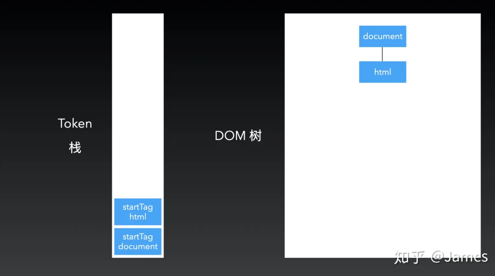
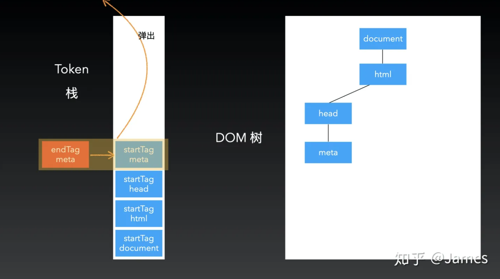
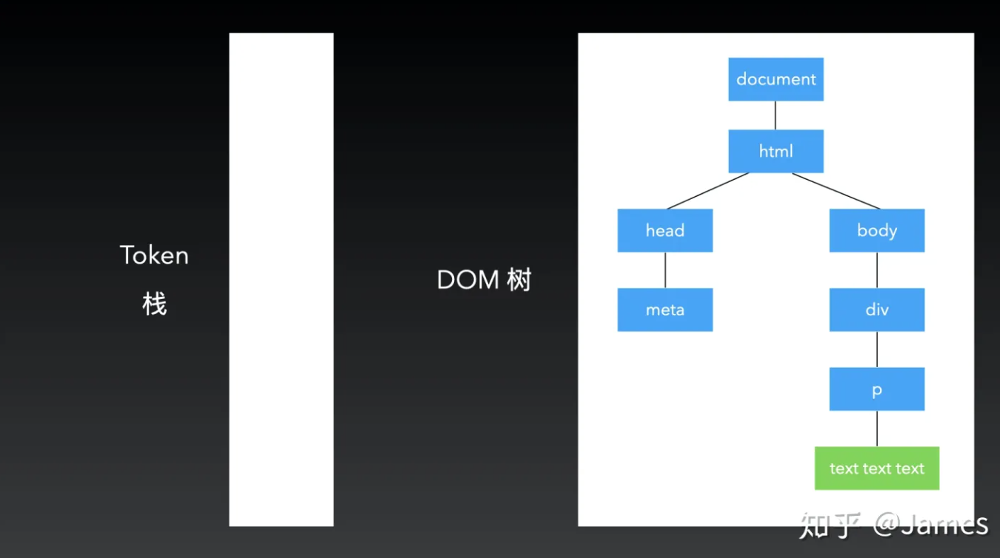

# https://zhuanlan.zhihu.com/p/138462744

在解析开始的时候，会默认创建一个根为 document 的空 DOM 结构。同时会将一个 startTag document 的 Token 放入栈底。

然后经过词法分析后的第一个 Token 会被持续的放入到栈中。同时会创建一个相应的 DOM 节点，用代码实现的话就是实例化一个元素。每生成一个 Token，就把它放入这个栈里面。当下一个 Token 是个 endTag 的时候，就会把栈里的 Token 一直弹出来，直到遇到一个和它的 tagName 一样的 Token 才停止。

然后就通过这样不断的入栈出栈，最后生成整个的 DOM 树。

