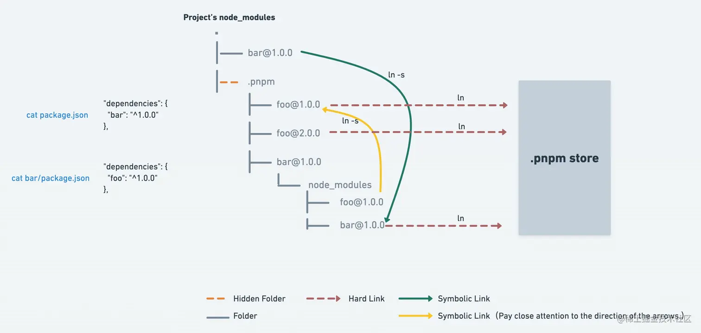

### yarn 和 npm 的缺点：

目前，使用 npm/yarn 安装包是扁平结构（以前是嵌套结构，npm3 之后改为扁平结构），扁平结构 就是安装一个包，那么这个包依赖的包将一起被安装到与这个包同级的目录下。

- 而扁平结构也同样存在问题：
  - 重复依赖：依赖结构的不确定性（不同包依赖某个包的不同版本 最终安装的版本具有不确定性）可通过 lock 文件确定安装版本
  - 幽灵依赖：非法访问未声明的包
  - 扁平化算法复杂，耗时

### pnpm 的优点

- 包安装速度极快
- 磁盘空间利用非常高效
- 支持 monorepo (lerna+yarn 也可以)
- 安全性高

### pnpm 原理：

- 当我们安装 bar 包时，根目录下只包含安装的包 bar
- 而 node*modules 目录下的 bar 包会软链接到.pnpm/bar/node_modules/bar@*.\_.\*
- bar 的依赖包 foo 会被提升到.pnpm 的根目录下，其他包依赖 foo 时也会软链接到这里
- 而 bar 和 foo 实际通过硬链接到.pnpm store 中

### 软链接和硬链接

在 pnpm 中，为了减少磁盘空间的占用和加快依赖项的安装速度，会使用链接的方式来共享依赖项。在链接的方式中，有软链接和硬链接两种方式。

软链接是指在文件系统中创建一个指向另一个文件或目录的指针。当你使用软链接时，你创建的是一个文件系统层级结构中的链接文件，而不是实际的文件或目录。在 pnpm 中，软链接是指在每个项目的 node_modules 文件夹中创建一个指向全局存储库的软链接，从而共享依赖项。

硬链接是指在文件系统中创建一个指向另一个文件或目录的物理链接。与软链接不同，硬链接不是指向文件系统层级结构中的一个文件，而是直接指向文件的物理位置。在 pnpm 中，硬链接是指将依赖项直接复制到项目的 node_modules 文件夹中，这样每个项目都会有自己的依赖项副本。

使用软链接可以节省磁盘空间，因为所有项目都共享同一个全局存储库中的依赖项。但是，软链接可能会影响性能，因为每次需要从全局存储库中读取依赖项。使用硬链接可以提高性能，因为每个项目都有自己的依赖项副本，但是会占用更多的磁盘空间。

在 pnpm 中，默认情况下会使用软链接来共享依赖项，但也可以通过命令行选项来使用硬链接。

在 Linux 和类 Unix 系统中，硬链接是指创建一个指向已经存在的文件的新链接，这个新链接的文件名与原文件名不同，但是它们指向同一个文件内容。因此，硬链接可以被认为是指向同一文件内容的两个或多个文件名。

从使用者的角度来看，通过硬链接创建的文件与原文件在内容和属性上没有区别，因为它们都指向相同的数据块。因此，如果对其中一个文件进行更改，那么其他所有硬链接也会受到影响。从这个意义上来说，可以将硬链接视为直接拷贝文件，因为它们实际上共享同一个数据块。

但是，从系统的角度来看，硬链接与直接拷贝文件还是有一些不同之处的。在使用硬链接时，系统只会在磁盘上保留一个数据块，多个文件名都指向这个数据块。因此，硬链接不会占用额外的磁盘空间，而直接拷贝文件则会占用相应的磁盘空间。此外，硬链接还可以节省系统资源，因为它们实际上只是同一文件的不同名称，而不是多个文件。
