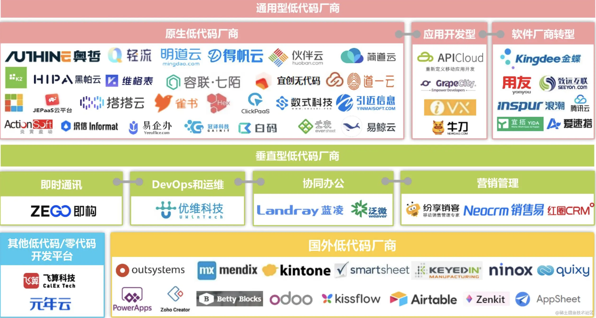

## 前言
----
这些年，自从 SaaS（Software-as-a-Service） 厂商 Salesforce 市值水涨船高，还和其大手笔的商业并购案，逐渐引起了国内互联网行业人的关注，习惯进行国内外产品对标的互联网圈子兴起了一股 SaaS 风潮，在后移动互联网时代下，部分人也期待 SaaS 可以成为国内互联网的一个新增长点。  
随着不同的用户诉求，一些系统衍生出新的形态，不同于既定的 SaaS 产品形态，用户可以通过可视化拖拽界面、表单配置等方式，快速定制出一个完整的应用，而且这一类系统基本不用编写太多的代码，即可以实现定制化应用。随着这一形态的系统越来越多，久而久之，大家就形象地称之为**”低代码”（low-code）**，另外也有人称之为 ”aPaaS“，即应用平台即服务（属于是互联网造词老技能了...）。  
低代码这个概念真正火热起来，还是在于这两年 Outsystems 相继完成了数轮过亿元美金的融资，估值早早地站上了十亿美金级别，成为一方独角兽。由于国内这一领域缺少体量对等的厂商，所以大家自然也在期待哪家厂商能成长为中国的 Outsystems。与此同时，国内低代码赛道上选手也渐渐进入了大家的视野，例如钉钉宜搭、即刻应用、氚云、简道云等等。

----

## 低代码平台简介
----
### 概念
广义上的低代码平台包括低代码平台和零代码平台，它们都属于APaaS（Application Platform as a Service  应用平台即服务），两者的主要区别在于对代码的依赖程度：
- 低代码平台：通过自动代码生成和可视化编程，只需要少量代码，即可快速搭建各种应用
- 零代码平台：零开发经验的业务人员通过拖拽等方式，无需编写代码，即可快速搭建各种应用  

以上可知，低代码平台面向开发人员，专业性较强，可以提高开发效率，但要求使用者具备一定的技术基础；零代码平台降低了开发门槛，从而将用户范围扩展到了业务人员。大家可以类比一下PhotoShop与美图秀秀，大概就是这么个区别。

----
### 优势及局限
相较于原生开发模式，低代码开发平台能显著提升开发效率，尤其适合业务变化快、预算有限、开发时间紧迫的企业应用场景；相较于只能解决行业通用问题的SaaS租用模式，低代码平台适用范围更广，可以满足个性化需求，有较强的灵活性。

低代码平台也有明显的局限性，至少就目前来说，它主要用于搭建企业软件，因为此类软件架构是有一定规律的，低代码平台的产品设计者正是找到了这种规律（快看，这就是智慧呀！），但它并不适合娱乐、社交等软件开发。此外，低代码平台成熟度也待进一步提升。

----
## 低代码系统长什么样
----
虽然低代码平台的形态很多，但是其中的核心还是脱离不开编程思想，基本都有以下功能模块：页面搭建、数据逻辑、数据模型，在线部署和管理系统。根据不同的业务场景，具体的平台形态分化为表单/数据模型驱动、界面驱动等形态。

----
### 表单/数据模型驱动
表单/数据模型驱动是围绕数据结构来定义整个应用的形态和流程，其中表单驱动指用户通过配置表单界面，元素大多是文本输入、下拉选择器、日期选择器等组件，配置表单界面后自动生成数据模型，并基于该表单做数据及流程管理，而数据模型驱动则更复杂，需要用户进行数据建模和定义模型关系，此操作和 SQL 数据库搭建类似，配置主键、索引，类型等等，然后基于该数据表单搭建上层的管理系统。该模式比较多应用在搭建 CRM、ERP 等管理系统。  

常见网站：
- [轻流](https://qingflow.com/)
- [维格表](https://vika.cn/)
- [vform](https://www.vform666.com/)
- [Alibaba Formily](https://v2.formilyjs.org/zh-CN)

----
### 界面驱动

界面驱动比较好理解，就是用户通过拖拽组件方式可视化搭建界面，然后配置页面的交互逻辑，比如页面的跳转、数据获取等等。这种形式大多应用在搭建通用程序的低代码平台

常见网站：
- [tmagic-editor](https://tencent.github.io/tmagic-editor/playground/index.html#/)
- [有赞](https://account.youzan.com/) (手机端店铺)
- [飞鱼](https://flyfish-demo.opscloudwise.com:23368/#/login) (大屏可视化)
- [mantine](https://mantine.dev/) (支持react组件库)

