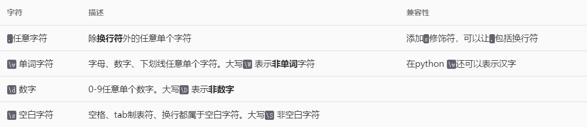
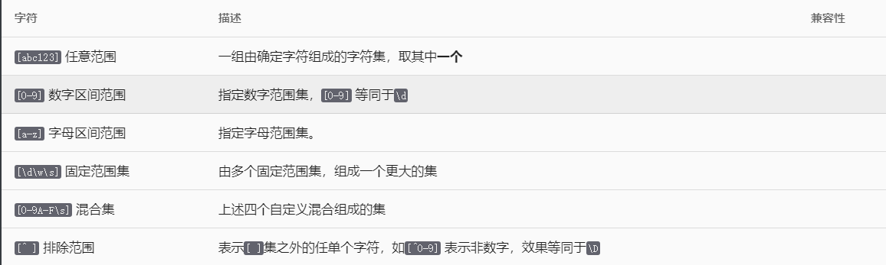
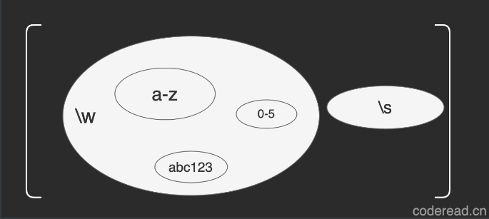
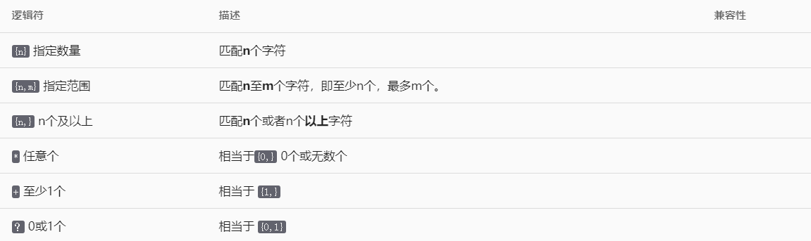
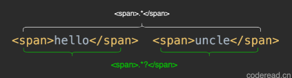
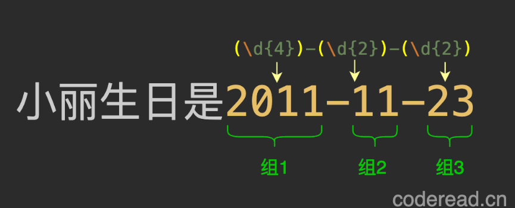
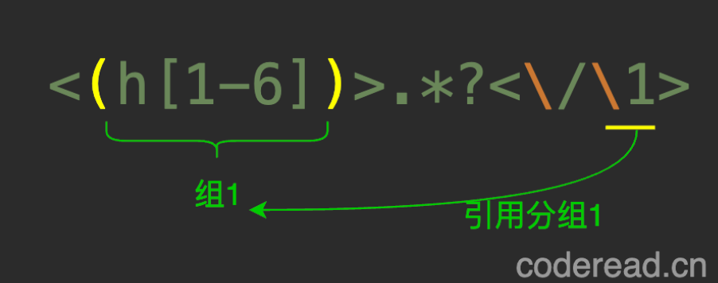
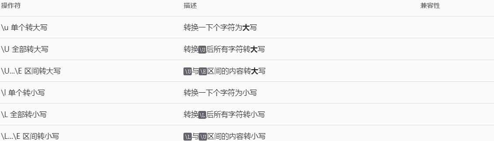
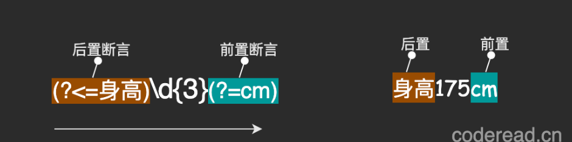
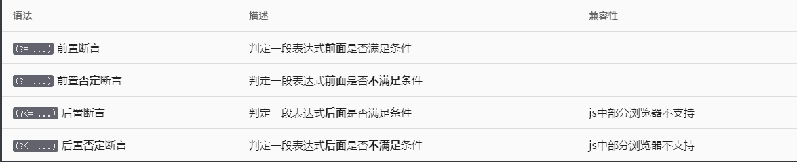

# 正则学习
- [学习地址](https://reg.coderead.cn/?u_dit=blili#/course/regex)

# 第一章基本字符  
## 组成正则的字符
  - 确定字符：一个最简单的正则表达式，就是一组确定字符，如hello就是一个正则表达式，它会匹配下文中的hello
  - 不确定字符: 正则使用场景中，搜索的字符大多是不完全确定的。如下文中的例子：
    ```
    【阿里云】您正在登录验证，验证码2571，
    切勿将验证码泄露于他人，本条验证码有效期15分钟。
    ```
    短信中的验证码是不确定的，只知道一个范围--是4位数字。这时就可以通过元字符\d去匹配，它表示一个0-9中一个数字。因为验证码是4个数字，所以匹配正则应是\d\d\d\d .
  - 混合字符: 更多正则匹配场景中，是确定与不确定的字符混合在一起。如要匹配下文中年龄就得这么写\d\d岁：
    ```
    曾小红，男,举重运动员，28岁，体重56KG，身高175cm。最好成绩：挺举98KG
    ```
    如果要匹配体重得这么写体重\d\dKG，体重与KG是确定的，中间\d\d是不确定的。
  - 小结：组成正则表达式的字符，有些是确定的，有些是不确定的，正则编写时要尽可能缩小不确定字符的范围。关于\d这类表范围字符，正则表达式中还有好几个，对于写好正则，非常重要。
## 范围字符
  - 对于确定字符可以直接匹配，对于不确定的可以用范围字符来代替。下表是常用范围字符
  
  如果我要匹配一个16进制的数字，它的范围是0-9数字或A-F字母组成。无法使用\w，因为它表示所有数字和字母。这时就需要自定义范围，十六进制范围写法是:[0-9A-F]。接下来我们系统学一下自定义范围的语法
## 自定义范围字符
  - 定定义范围指由多个字符，多个范围字符组成的集合，取其中任意一个。
      
    几组小集合,通过[ ]组合成一个大集合。  
    

# 第二章逻辑控制
## 基本逻辑控制
  - 正则中的逻辑控制符并不多，只有以下三组：
  
  | 表示或者的意思，类似编程中的条件|| 。在正则中它作用于字符或子表达式。示例：401|403|404|500 匹配401、404、404、500中任一组字符。它的语法非常简单，日常工作中又特别常用，所以学习它性价比极高。  
  - 如果要匹配 | 本身，需要进行转义，如：\| 表示匹配 | 符号，或者放在自定义范围集中[|]也可以有同样效果。  
  由于 | 在类Unix系统中是特殊字符，当你使用grep或 vim 进行正则搜索时，必须进行转义。
  - ()在工作中极其常用，与编程中的括号作用类似 如 (1+2)*3=9 ，它们都是把一段逻辑进行拆分独立运算，再组合一起。如(www|mvn|test).coderead.cn 表示子域名为www、mvn、test任意一个。这里子域名就是一个子表达式。试想如果把()去掉会怎么样？这时匹配结果就是 www或mvn或者test.coderead.cn，这显然不符合预期。
## 数量控制
  - 数量控制作用于字符或子表达式，已限制其数量范围。\d{6}表示必须是6位数字。请注意：一个{}仅作用于其前面的单个字符如：hi{2} 表示hii,而不是hihi。  
  数量控制有以下几种编写方式：
   
  {n}匹配n个固定数量
  {}即可以作用在字符上，还可以作用于子表达示。如在文本中提取域名时可能包含http://协议头，也可能不包含就可以这么写((http|https):\/\/){0,1}www.coderead.cn
    ```
    www.coderead.cn
    http://www.coderead.cn
    https://www.coderead.cn
    ```  
  - *+?量词简写  
    *表示任意次 ，等同于{0,}  
    +表示1次以上，等同于{1,}  
    ?表示0次或1次，等同于{0,1}  
    通过简写该正则((http|https):\/\/){0,1}www.coderead.cn 可以如何优化？  
    协议头部分是0或1个就可以用?代替，优化成((http|https):\/\/)?www.coderead.cn  
    此外https只比http多了一个s，就可以进一步优化成：(https?\/\/)?www.coderead.cn 是不是就简单多了
    ```
      /**
        请匹配文中指定的http链接
        规则如下：
        必须以http或https开头
        必须以com|cn|io|net结尾
        域名只能是数字、字母、下划线组成
        子域名可以为空，如：http://coderead.cn
        正确示例:https://weixin.qq.io 
      */

      const reg = /https?:\/\/(\w+\.)?(\w+)\.(com|cn|io|net)/

      www.coderead.cn  //false
      http://www.coderead.cn  //true
      https://www.coderead.com  //true
      http://coderead2.io  //true
      http://www.csdn.zzz  //false
      http://weichat.vip1  //false
      https://wei#chat.cn  //false
      weichat.vip1  //false
      https://qq.com  //true
      https://open.qq.com  //true
      https://weixin.qq.io  //true
    ```


  - ? 最少化匹配（懒惰匹配）  
      下文包括几对<span> </span> 标签？(3对)
    ```  
      <span>hello</span>  <span>uncle</span>
    ``` 
         
      你以为是2对，其实是3对，因为整个文本也是1对。使用<span>.*</span> 它会匹配哪1队呢？它会直接匹配最大的第3对，这显然不符合我们的预期，这时就就可以在量词后加?，告诉引擎按最少化来匹配。  
      ?表示最小化匹配，也叫懒惰匹配，只能用在量词后面，表示如果多个文本段同时满足条件，则匹配最短的。?可以用在所有量词后面，甚至是?? ,但这个量词不能是固定的值，如:hel{2}?o 这是没有意义的。因为它不存在最少和最多。 
  - 练习：匹配Html 注释
    ```
    /**
     *在阅读源码时，注释太多反而会影响阅读，这时我会用正则匹配出来，然后一键清除。好吧，本章过关练习就是它了，使用正则匹配html 注释。html有三种类型的注释，分别是：
    * 1.  <!-- -->  标签注释，作用于html 标签中，支持换行  
    * 2.  /* */ 脚本注释，作用于javascript中 ,支持换行  
    * 3.  / /脚本单行注释， 作用于javascript中，不支持换行  
    *  
    *  请匹配出所有html 注释
    */   

    <html lang="en">
    <body>
      <!-- 标签注释块1 --> <br/> <!-- 标签注释块2 -->
      <div id="app"></div>
      <!-- 
        标签多行注释
      -->
    </body>
    <script>
      /*注释块1*/ console.log(""); /*注释块2*/
      // 单行注释
      /*
      多行注释
      */
    </script>
    </html>

    参考答案
    正则：/\/\/.*|<!--(.|\n)*?-->|\/\*[\d\D]*?\*\//gm
    ```

# 第三章分组引用与替换
## 什么是分组

- 分组指将匹配的内容，使用( )划分成多个组块，分好的组可用于提取、反向引用以及替换操作。
  ```
  "小丽生日是2011-11-23".match(/(\d{4})-(\d{2})-(\d{2})/);
  // 得出结果如下：
  ['2011-11-23', '2011', '11', '23']
  ```
   

## 反向引用
  - 反向引用指通过\组号引用之前的分组，可以把分组理解成一个变量，在通过变量名(组号)引用。它不能引用之后的内容，固作称作反向引用，比如这样正则是错误的：<\1>.*?<\/(h[1-6])>
    ```
    要提取以下html 中所有合法标题，
    <h1>一级标题</h1>
    <h2>二级标题</h2>
    <h2>三级标题</h3>
    <h4>四级标题</h4>
    <h5>五级标题</h5>
    <h6>六级标题</ha>

    参考答案： 
    /<(h[1-6])>.*?<\/\1>/gm

    解析：
    <(h[1-6])> 匹配开始标签，并把标签名加入分组1  
    .*? 标签中间可以是任意内容。  
    <\/\1> 匹配结束标签，标签内容通过\1引用分组1（意思是与分组1的内容一致）
    ```

    

## 引用替换
  - 我们经常使正则然后进行替换操作，比如匹配文中所有空行，然后替换成空(删除它)，又或者是找出错误的单词，替换成正确的。其实正则有更为强大的替换能力，比如把普通文中所有http链接，一键替换成a标签，更厉害一点还可以把文本替换成 insert sql 语句。
  但是在学习这些复杂替换操作前，先学习一些简单的。请找出下文中所有日期，并统一替换成yyyy-MM-dd格式：
    ```
        姓名    / 籍贯      体重    生日
      于小彤 / 中国辽宁 / 63 KG / 1994-05-27
      张惠妹 / 台湾台东县卑南乡 / 46 KG / 1972/08/09
      沈佳妮 / 中国上海 / 51 KG / 1983.05.22
      沈丹萍 / 中国南京 / 65 KG / 1960/02/19
      王紫逸 / 中国香港 / 65 KG / 1986/12/15
      吴健 / 中国淄博 / 68 KG / 1978.01.03
      金荷娜 / 韩国 / 48 KG / 1978/02/21
      张曼玉 / 中国 / 40 KG / 1964/09/20
      薛佳凝 / 哈尔滨 / 45 KG / 1978/08/13

      参考答案：
      正则：/(\d{4})[-.\/](\d{2})[-.\/](\d{2})/gm
      替换：$1-$2-$3

      解析：
      写出匹配日期的正则：\d{4}[-.\/]\d{2}[-.\/]\d{2}
      对日期年、月、日进行分组：(\d{4})[-.\/](\d{2})[-.\/](\d{2})
      在替换字符中引用分组：$1-$2-$3
    ```
    ```
    "1978/08/13 1991.28.11".replaceAll(/(\d{4})[-.\/](\d{2})[-.\/](\d{2})/g,"$1-$2-$3")
    // 输出结果
    1978-08-13 1991-28-11
    ```

  - 大小写转换
  

## 分组的其它应用
  - (?<名称> )命名分组
  - (?: ) 移除分组
  - ( ( ) )嵌套分组
  - ()+分组使用量词
在日常开发工作中，经常有需求将文本内容导入到数据库，常见的做法是，使用数据导入工具，并按照一定格式解析文本导入。如果你需过滤掉错误行，又或者统一日期格式等自定义操作，这时就可以使用正则的替换操作来完成。把文本替换成 Insert Sql 然后在导入。
  ```
  请将文本替换成 Insert Sql语句
  规则说明：
  表名：user
  列名：name,city,weight,birthday
  日期统一为：yyyy-MM-dd 格式
  示例：insert into user (name,city,weight,birthday) values('张惠妹','台湾台东县卑南乡',46,'1972-08-09');
  
  测试文本
  于小彤 / 中国辽宁 / 63 KG / 1994-05-27
  张惠妹 / 台湾台东县卑南乡 / 46 KG / 1972/08/09
  沈佳妮 / 中国上海 / 51 KG / 1983.05.22
  沈丹萍 / 中国南京 / 65 KG / 1960/02/19
  王紫逸 / 中国香港 / 65 KG / 1986/12/15
  吴健 / 中国淄博 / 68 KG / 1978.01.03
  金荷娜 / 韩国 / 48 KG / 1978/02/21
  张曼玉 / 中国 / 40 KG / 1964/09/20
  薛佳凝 / 哈尔滨 / 45 KG / 1978/08/13

  预期效果：
  insert into user (name,city,weight,birthday) values('于小彤','中国辽宁',63,'1994-05-27');
  insert into user (name,city,weight,birthday) values('张惠妹','台湾台东县卑南乡',46,'1972-08-09');
  insert into user (name,city,weight,birthday) values('沈佳妮','中国上海',51,'1983-05-22');
  insert into user (name,city,weight,birthday) values('沈丹萍','中国南京',65,'1960-02-19');
  insert into user (name,city,weight,birthday) values('王紫逸','中国香港',65,'1986-12-15');
  insert into user (name,city,weight,birthday) values('吴健','中国淄博',68,'1978-01-03');
  insert into user (name,city,weight,birthday) values('金荷娜','韩国',48,'1978-02-21');
  insert into user (name,city,weight,birthday) values('张曼玉','中国',40,'1964-09-20');
  insert into user (name,city,weight,birthday) values('薛佳凝','哈尔滨',45,'1978-08-13');

  参考答案：
  正则：(.+?) / (.+?) / (\d{2}) KG / (\d{4}).(\d{2}).(\d{2})
  替换：insert into user (name,city,weight,birthday) values('$1','$2',$3,'$4-$5-$6');
  ```


# 第四章边界断言

之前学的正则都是在表示字符如何匹配，边界断言终于让其有了条件判断能力。由此可以编写更为强大的正则  

## 普通边界断言
- 定义：边界断言指一段表达式前后是否满足指定条件，该条件由一个子表达式组成，基于前后字符能否匹配来计算布尔值。因断言部分不会消耗匹配字符，固又称为零宽断言。

- 边界断言包含以下四种语法：

所谓前置后置是以一段表达式为中心的前面与后面，而不是断言条件本身所处的前后位置。
```
前置断言
请匹配文中所有体重数字(不包括单位和空格)
小提示： (?= ) 断言括号中可以是任意子表达式
注意区分单位的大小写

姓名    编号   籍贯     体重    生日
于小彤 /  12 / 中国辽宁 / 63 KG / 1994-05-27
张惠妹 /  78 / 台湾台东县卑南乡 / 46 KG / 1972-08-09
沈佳妮 /  33 / 中国上海 / 51 kg / 1983-05-22
沈丹萍 /  34 / 中国南京 / 65 KG / 1960-02-19
王紫逸 /  3 / 中国香港 / 65 kg / 1986-12-15


答案： /\d{2}(?= KG| kg)/gm
解析： (?! ) 前置断言否定式，表示一段表达式前面不能匹配括号中子表达式。
```
- (?<= )后置断言，表示边界后置是否满足条件。如(?<=验证码)\d{5} 表示数字前三个字符必须"验证码"。   
后置断言在javascript中只有部分浏览器支持。另外后置断言非常消耗性能，所以不推荐使用无限大的量词如：* + {n,}。甚至在JAVA、Python、PHP会直接报语法错误。举例 (?<=.+)aa 就是是错误的，必须改成一个有限范围如： (?<=.{1,200})aa  
前后置断言在解析html有奇效，比如爬取一张网页以后解析所有<a href=""></a>中的链接，来一起实现它。
```
后置断言
请匹配所有
a
标签中链接(不包括标签名)
小提示：
?最少化匹配
(?=)前置断言
(?<=)后置断言
示例：https://www.taobao.com/

<html lang="en">
<head>
  <script src="https://cdn.bootcdn.net/highlight.min.js"></script>
  <link href="https://cdn.bootcdn.net/default.min.css" rel="stylesheet">
</head>
<body>
  <div id="app"></div>
  <a href="/save" > 保存</a> 友情链接<a href="https://www.baidu.com">baidu </a>
  <a   id="a1" href="https://www.github.com?id=f%22"  >github </a>  
  <a id="aa" href="https://www.taobao.com/">taobao </a>
</body>
</html>


答案： /(?<=<a.{1,100}href=\").*?(?=\")/gm
解析： (?<！)后置断言否定式，表示一段表达式后面不能匹配括号中子表达式
```

## 高级特性
- 零宽断言：断言条件本身不会消耗字符
- **多边界断言:**一个正则可同时存在多个边界断言。根据其所处位置来决定断言的边界。
- 条件组合:多个子断言可以进行布尔运算如：&& || ()，
- 任意边界：可以是任意合法的表达式边界，甚至可以是空字符边界。
```
零宽断言

匹配文中所有被@的昵称（包括
@
符号）
小提示：
?最少化匹配
(?=)前置断言
示例：@鱼皮

@鲁班大叔@鱼皮 @程序羊 @水哥 hello up 主们

答案：/@.+?(?=@|\s)/gm
解析：如果使用@.+?[@ ]匹配结果是@鲁班大叔@鱼皮@水哥 hello up主们*，中间的“鱼皮”没有被匹配，因为“鲁班大叔”后的**@*被消耗了，而这是和“鱼皮”共享的@**。正确的写法是@.+?(?=@|\s) ，使用**@**断言结尾之后，还可以继续为后面的匹配项目继续使用。
有时零宽断言也会带来一些困扰，比如匹配短句“hello up” 如果使用(?<= )hello(?= )up 是无法匹的。因为中间空格没有被包含进去，所以要加入进去。所以切记，条件只是条件不会消耗字符。
```
- 多边界断言:
一个正则可同时存在多个边界断言，根据其所处位置来决定断言的边界，如:hello(?= ) up(?= ),第一个断言以hello 作为边界，第二个断言以 up 作为边界。
- 条件组合
边界条件本质上就是布尔值计算，其自然可以进行类似&& || ()布尔运算，以应对更复杂的场景。其书写方式有以几种：
  - h(?=条件1)(?=条件2) 且运算,指必须同时满足多个条件
  - h(?=(?=条件1)(?=条件2)) 且运算,条件1与条件2组成一个新条件,并且两个条件都必须满足
  - h(?=(?=条件1)|(?!条件2)) 或运算,满足条件1或者 不满足 条件2
  - h(?=表达式1|(?=条件1)(?!条件2)) 混合运算,表示满足表达式1或者同时满足条件1、2
```
请匹配文中错误的颜色代码
1. 以#开头，以;结尾
2. 必须是16进制数值，数字 或字母a-f
3. 数值长度必须是6位或者3位
示例：#112H3;


html{   
    color: #e1e1e;
    background-color: #1e1e1e;
}
body{
    color: #55432c;
    background-color: #53e; 
}
div{
    color: #55h32c;
}

答案：/#(?![\da-f]{6};|[\da-f]{3};).{0,7}/gm
解析：写出正确的匹配正则：#[\da-f]{6}|[\da-f]{3};
基于前置否定断言判断 # 后是否 不满足 条件：#(?![\da-f]{6};|[\da-f]{3};)
然后把错误的字符加上：#(?![\da-f]{6};|[\da-f]{3};).{0,7}

```

```
任意边界

找出所有符合条件的密码
1. 密码长度是8-20位
2. 大小写字母以及数字必须都有一个。

123Abd3%$^
fli2ckfjf233
fffa
eiffla!@AAfb
afffA12bfffffffffddd3333333333333333311
123AAFFa
fffaaa!!@23.09
afffAAAfff33122
1129938.exe

答案：/(?=^.{8,20}$)(?=.*[A-Z])(?=.*[a-z])(?=.*[\d]).+/gm

解析：
先尝使用用常规正则进行匹配如：.*[A-Z].*[a-z].*\d，仔细推断一下就知道这不行，因为不知道大小写字母或数字出现的位置以及顺序，而且也无法确定其数量范围。
实现上述需就可以采用分而治之的思路，把每个条件分别进行计算：
验证长度：(?=^.{8,20}$),表示总字符长度在8至20之间。^ $ 是两个特殊字符，这里分别表示文本的开头与结尾，将在后续章节专门学习。
验证大写字母：(?=.*[A-Z])，表示文中任意地方至少出现一次大写字母。
验证小写字母：(?=.*[a-z])，表示文中任意地方至少出现一次小写字母。
验证数字：(?=.*\d)，表示文中任意地方至少出现一次数字。
最后组合条件并追加内容 (?=^.{8,20}$)(?=.*[A-Z])(?=.*[a-z])(?=.*[\d]).+
```