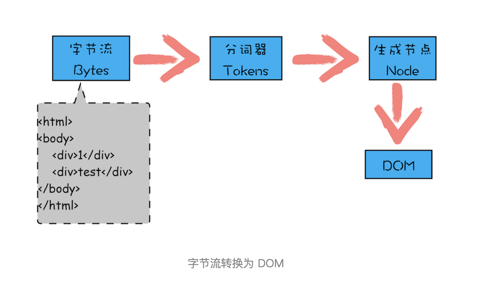
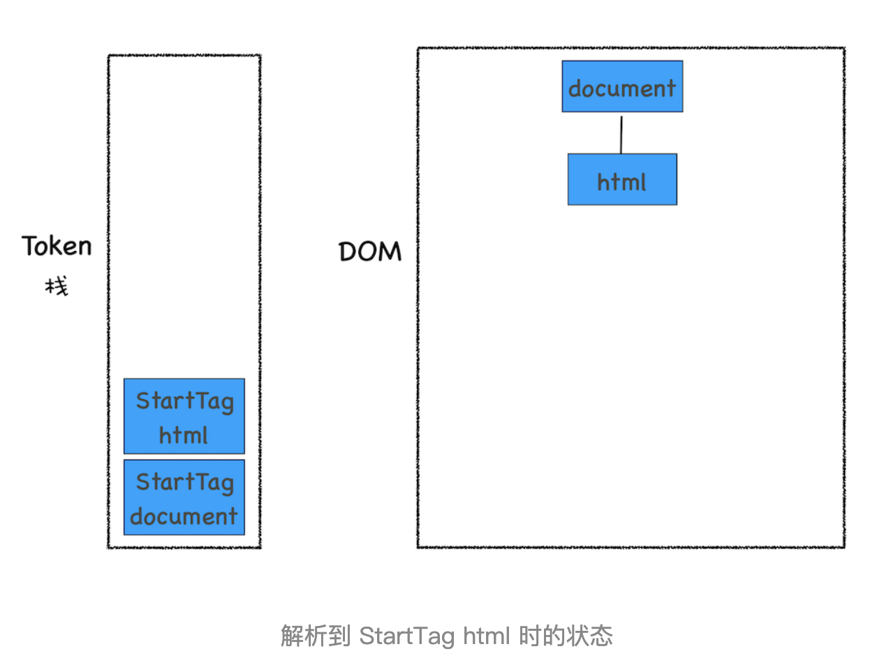
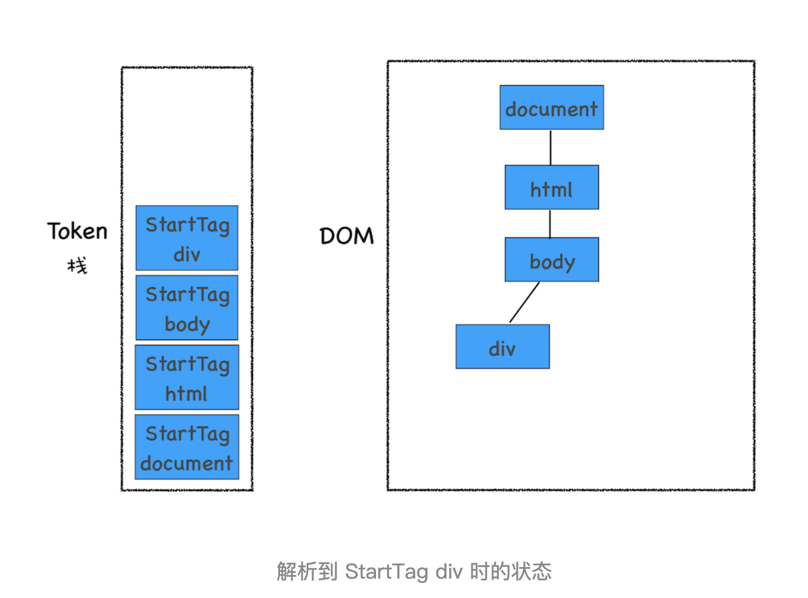
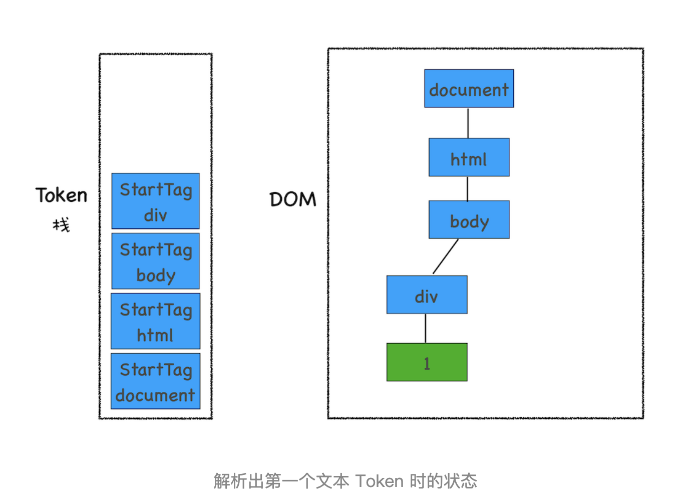
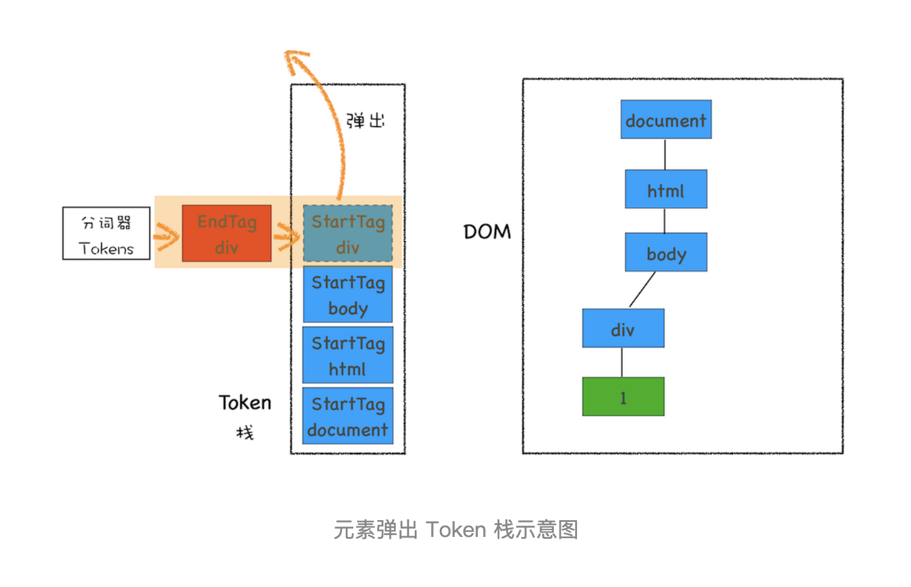
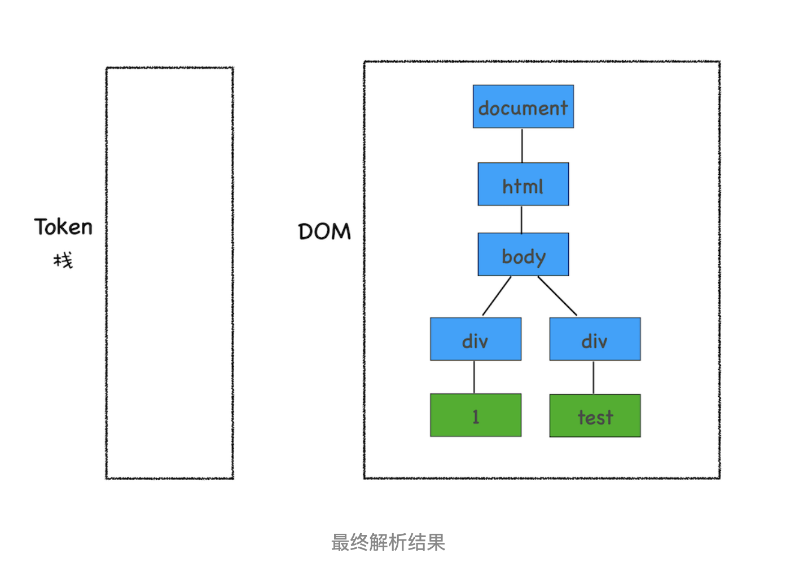
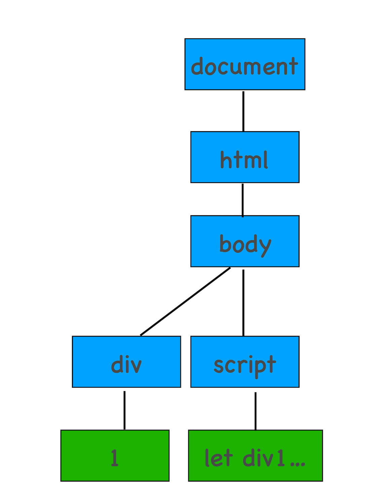

# DOM树：JavaScript是如何影响DOM树构建的

在上一篇文章中，我们通过开发者工具中的网络面板，介绍了网络请求过程的几种性能指标以及对页面加载的影响。

而在渲染流水线中，后面的步骤都直接或者间接地依赖于 DOM 结构，所以本文我们就继续沿着网络数据流路径来介绍 DOM 树是怎么生成的。然后再基于 DOM 树的解析流程介绍两块内容：第一个是在解析过程中遇到 JavaScript 脚本，DOM 解析器是如何处理的？第二个是 DOM 解析器是如何处理跨站点资源的？

## 什么是 DOM

从网络传给渲染引擎的 HTML 文件字节流是无法直接被渲染引擎理解的，所以要将其转化为渲染引擎能够理解的内部结构，这个结构就是 DOM。DOM 提供了对 HTML 文档结构化的表述。在渲染引擎中，DOM 有三个层面的作用。

- 从页面的视角来看，DOM 是生成页面的基础数据结构。

- 从 JavaScript 脚本视角来看，DOM 提供给 JavaScript 脚本操作的接口，通过这套接口，JavaScript 可以对 DOM 结构进行访问，从而改变文档的结构、样式和内容。

- 从安全视角来看，DOM 是一道安全防护线，一些不安全的内容在 DOM 解析阶段就被拒之门外了。

简言之，DOM 是表述 HTML 的内部数据结构，它会将 Web 页面和 JavaScript 脚本连接起来，并过滤一些不安全的内容。

## DOM 树如何生成

在渲染引擎内部，有一个叫 HTML 解析器（HTMLParser）的模块，它的职责就是负责将 HTML 字节流转换为 DOM 结构。所以这里我们需要先搞清楚 HTML 解析器是怎么工作的。

在开始介绍 HTML 解析器之前，我要先解释一个大家在留言区问到好几次的问题：HTML 解析器是等整个 HTML 文档加载完成之后开始解析的，还是随着 HTML 文档边加载边解析的？

在这里我统一解答下，HTML 解析器并不是等整个文档加载完成之后再解析的，而是网络进程加载了多少数据，HTML 解析器便解析多少数据。

那详细的流程是怎样的呢？网络进程接收到响应头之后，会根据响应头的 content-type 字段来判断文件的类型，比如 content-type 的值是“text/html”，那么浏览器就会判断这是一个 HTML 类型的文件，然后为请求选择或者创建一个渲染进程。渲染进程准备好之后，网络进程和渲染进程之后会建立一个共享数据的管道，网络进程接收到数据后就往这个管道里面放，而渲染进程则从管道的另一端不断地读取数据，并同时将读取的数据“喂”给 HTML 解析器。你可以把这个管道想象成一个“水管”，网络进程接收到的字节流像水一样倒进这个“水管”，而“水管”的另外一端是渲染进程的 HTML 解析器，它会动态接收字节流，并将其解析为 DOM。

解答完这个问题之后，接下来我们就可以来详细聊聊 DOM 的具体生成过程了。

前面我们说过代码从网络传输过来是字节流的形式，那么后续字节流是如何转换为 DOM 的呢？你可以参考下图：



从图中你可以看出，字节流转化为 DOM 需要三个阶段。

**第一个阶段，通过分词器将字节流转换为 Token**。

前面《14 | 编译器和解释器：V8 是如何执行一段 JavaScript 代码的？》文章中我们介绍过，V8 编译 JavaScript 过程中的第一步是做词法分析，将 JavaScript 先分解为一个个 Token。解析 HTML 也是一样的，需要通过分词器先将字节流转换为一个个 Token，分为 Tag Token 和文本 Token。上述 HTML 代码通过词法分析生成的 Token 如下所示：


由图可以看出，Tag Token 又分 StartTag 和 EndTag，分别对应图中的蓝色和红色块，文本 Token 对应的绿色块。

**至于后续的第二个和第三个阶段是同步进行的，需要将 Token 解析为 DOM 节点，并将 DOM 节点添加到 DOM 树中**。

> HTML 解析器维护了一个 Token 栈结构，该 Token 栈主要用来计算节点之间的父子关系，在第一个阶段中生成的 Token 会被按照顺序压到整个栈中。具体的处理规则如下所示：

- 如果压入到栈中的是 StartTag Token，HTML 解析器会为该 Token 创建一个 DOM 节点，然后将该节点加入到 DOM 树中，它的父节点就是栈中相邻的那个元素生成的节点。

- 如果分词器解析出来的是文本 Token，那么会生成一个文本节点，然后将该节点加入到 DOM 树中，文本 Token 是不需要压入到栈中，它的父节点就是当前栈顶 Token 所对应的 DOM 节点。

- 如果分词器解析出来的是 EndTag 标签，比如 EndTag div，HTML 解析器会查看 Token 栈顶的元素是否是 StartTag div，如果是，就将 StartTag div 从栈中弹出，表示该 div 元素解析完成。

通过分词器产生的新 Token 就这样不停地压栈和出栈，整个解析过程就这样一直持续下去，直到分词器将所有字节流分词完成。

为了更加直观地理解整个过程，下面我们结合一段 HTML 代码（如下），来一步步分析 DOM 树的生成过程。

```html
<html>
  <body>
    <div>1</div>
    <div>test</div>
  </body>
</html>
```

这段代码以字节流的形式传给了 HTML 解析器，经过分词器处理，解析出来的第一个 Token 是 StartTag html，解析出来的 Token 会被压入到栈中，并同时创建一个 html 的 DOM 节点，将其加入到 DOM 树中。

这里需要补充说明下，HTML 解析器开始工作时，会默认创建一个根为 document 的空 DOM 结构，同时会将一个 StartTag document 的 Token 压入栈底。然后经过分词器解析出来的第一个 StartTag html Token 会被压入到栈中，并创建一个 html 的 DOM 节点，添加到 document 上，如下图所示：



然后按照同样的流程解析出来 StartTag body 和 StartTag div，其 Token 栈和 DOM 的状态如下图所示：



接下来解析出来的是第一个 div 的文本 Token，渲染引擎会为该 Token 创建一个文本节点，并将该 Token 添加到 DOM 中，它的父节点就是当前 Token 栈顶元素对应的节点，如下图所示：



再接下来，分词器解析出来第一个 EndTag div，这时候 HTML 解析器会去判断当前栈顶的元素是否是 StartTag div，如果是则从栈顶弹出 StartTag div，如下图所示：



按照同样的规则，一路解析，最终结果如下图所示：



通过上面的介绍，相信你已经清楚 DOM 是怎么生成的了。不过在实际生产环境中，HTML 源文件中既包含 CSS 和 JavaScript，又包含图片、音频、视频等文件，所以处理过程远比上面这个示范 Demo复杂。不过理解了这个简单的 Demo 生成过程，我们就可以往下分析更加复杂的场景了。

## JavaScript 是如何影响 DOM 生成的

我们再来看看稍微复杂点的 HTML 文件，如下图所示：

```html
<html>
  <body>
    <div>1</div>
    <script>
      let div1 = document.getElementsByTagName('div')[0]
      div1.innerText = 'time.geekbang'
    </script>
    <div>test</div>
  </body>
</html>
```

我在两段 div 中间插入了一段 JavaScript 脚本，这段脚本的解析过程就有点不一样了。script 标签之前，所有的解析流程还是和之前介绍的一样，但是解析到 script 标签时，渲染引擎判断这是一段脚本，此时 HTML 解析器就会暂停 DOM 的解析，因为接下来的 JavaScript 可能要修改当前已经生成的 DOM 结构。

通过前面 DOM 生成流程分析，我们已经知道当解析到 script 脚本标签时，其 DOM 树结构如下所示：



这时候 HTML 解析器暂停工作，JavaScript 引擎介入，并执行 script 标签中的这段脚本，因为这段 JavaScript 脚本修改了 DOM 中第一个 div 中的内容，所以执行这段脚本之后，div 节点内容已经修改为 time.geekbang 了。脚本执行完成之后，HTML 解析器恢复解析过程，继续解析后续的内容，直至生成最终的 DOM。

以上过程应该还是比较好理解的，不过除了在页面中直接内嵌 JavaScript 脚本之外，我们还通常需要在页面中引入 JavaScript 文本，这个解析过程就稍微复杂了些，如下面代码：

```js
//foo.js
let div1 = document.getElementsByTagName('div')[0]
div1.innerText = 'time.geekbang'
```

```html
<html>
  <body>
    <div>1</div>
    <script type="text/javascript" src='foo.js'></script>
    <div>test</div>
  </body>
</html>
```

这段代码的功能还是和前面那段代码是一样的，不过这里我把内嵌 JavaScript 脚本修改成了通过 JavaScript 文件加载。其整个执行流程还是一样的，执行到 JavaScript 标签时，暂停整个 DOM 的解析，执行 JavaScript 代码，不过这里执行 JavaScript 时，需要先下载这段 JavaScript 代码。这里需要重点关注下下载环境，因为 JavaScript 文件的下载过程会阻塞 DOM 解析，而通常下载又是非常耗时的，会受到网络环境、JavaScript 文件大小等因素的影响。

不过 Chrome 浏览器做了很多优化，其中一个主要的优化是预解析操作。当渲染引擎收到字节流之后，会开启一个预解析线程，用来分析 HTML 文件中包含的 JavaScript、CSS 等相关文件，解析到相关文件之后，预解析线程会提前下载这些文件。

再回到 DOM 解析上，我们知道引入 JavaScript 线程会阻塞 DOM，不过也有一些相关的策略来规避，比如使用 CDN 来加速 JavaScript 文件的加载，压缩 JavaScript 文件的体积。另外，如果 JavaScript 文件中没有操作 DOM 相关代码，就可以将该 JavaScript 脚本设置为异步加载，通过 async 或 defer 来标记代码，使用方式如下所示：

```html
<script async type="text/javascript" src='foo.js'></script>
```

```html
<script defer type="text/javascript" src='foo.js'></script>
```

async 和 defer 虽然都是异步的，不过还有一些差异，使用 async 标记的脚本文件一旦加载完成，会立即执行；而使用了 defer 标记的脚本文件，需要在 DOMContentLoaded 事件之前执行。

现在我们知道了 JavaScript 是如何阻塞 DOM 解析的了，那接下来我们再来结合文中代码看看另外一种情况：

```html
<head>
  <style src='theme.css'></style>
</head>
```

```html
<html>
  <body>
    <div>1</div>
      <script>
        let div1 = document.getElementsByTagName('div')[0]
        div1.innerText = 'time.geekbang' // 需要 DOM
        div1.style.color = 'red' // 需要 CSSOM
      </script>
    <div>test</div>
  </body>
</html>
```

该示例中，JavaScript 代码出现了 div1.style.color = 'red' 的语句，它是用来操纵 CSSOM 的，所以在执行 JavaScript 之前，需要先解析 JavaScript 语句之上所有的 CSS 样式。所以如果代码里引用了外部的 CSS 文件，那么在执行 JavaScript 之前，还需要等待外部的 CSS 文件下载完成，并解析生成 CSSOM 对象之后，才能执行 JavaScript 脚本。

而 JavaScript 引擎在解析 JavaScript 之前，是不知道 JavaScript 是否操纵了 CSSOM 的，所以渲染引擎在遇到 JavaScript 脚本时，不管该脚本是否操纵了 CSSOM，都会执行 CSS 文件下载，解析操作，再执行 JavaScript 脚本。

所以说 JavaScript 脚本是依赖样式表的，这又多了一个阻塞过程。至于如何优化，我们在下篇文章中再来深入探讨。

通过上面的分析，我们知道了 JavaScript 会阻塞 DOM 的生成，而样式文件又会阻塞 JavaScript 的执行，所以在实际的工程中需要重点关注 JavaScript 文件和样式表文件，使用不当会影响到页面性能。

## 总结

好了，今天就讲到这里，下面我来总结下今天的内容。

首先我们介绍了 DOM 是如何生成的，然后又基于 DOM 的生成过程分析了 JavaScript 是如何影响到 DOM 生成的。因为 CSS 和 JavaScript 都会影响到 DOM 的生成，所以我们又介绍了一些加速生成 DOM 的方案，理解了这些，能让你更加深刻地理解如何去优化首次页面渲染。

额外说明一下，渲染引擎还有一个安全检查模块叫 XSSAuditor，是用来检测词法安全的。在分词器解析出来 Token 之后，它会检测这些模块是否安全，比如是否应用了外部脚本，是否符合 CSP 规范，是否存在跨站点请求等。如果出现不符合规范的内容，XSSAuditor 会对该脚本或者下载任务进行拦截。详细内容我们会在后面的安全模块介绍，这里就不赘述了。
